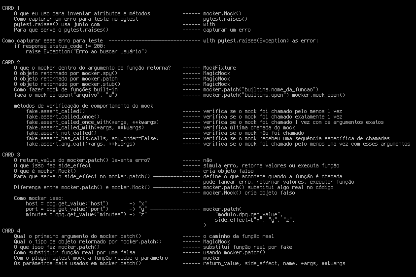

# 🧪 TDD com Pytest — 100 Projetos Práticos 


   
<p align="center">
  
  
</p>
  
### Nenhuma IA foi usada neste repositório. Este repositório é dedicado ao estudo de pytest e aplicações do TDD.

Este repositório foi criado com base no estudo do livro  **Test-Driven Development: By Example**, de Kent Beck, com o objetivo de aplicar na prática os conceitos de **Desenvolvimento Guiado por Testes (TDD)** utilizando pytest.

A proposta consiste em **100 projetos/exercícios**, cada um explorando diferentes cenários e mecânicas de teste, sempre seguindo o ciclo fundamental do TDD:

> Red → Green → Refactor

Ao longo dos projetos, são abordados:

- Criação de testes antes da implementação  
- Escrita de código orientada a testes  
- Refatoração contínua  
- Uso de mocks e isolamento de dependências  
- Parametrização e organização de testes  
- Boas práticas de design para código testável  

Mais do que aprender uma ferramenta como o pytest, este repositório tem como foco desenvolver uma mentalidade de engenharia de software baseada em **testabilidade, simplicidade e feedback rápido**.

Este projeto funciona tanto como laboratório de aprendizado quanto como portfólio, demonstrando a aplicação prática de TDD em Python.
<hr>


> ⚠️ **Disclaimer**  
> This repository is a TDD study project using pytest.  
> AI tools were used exclusively to generate the functions under test in order to speed up scenario creation.  
> All test cases and development following the Red-Green-Refactor cycle were written manually.
## 🧪 1 - Teste unitário de uma função de soma


```python
import pytest

def sum(x: int, y: int) -> int:
    return x + y

def test_sum_succes() -> None:
    assert sun(10,10) == 20 
```

Veja que fiz um teste unitário: todo teste unitário é único, não depende de nada para funcionar, apenas da própria função. 

## 🧪 2 - testando vários parâmetros em um único teste unitário

```python
import pytest

def sum(x: int, y: int) -> int:
    return x + y

@pytest.mark.parametrize('x , y, output',[
    (1,1,2),
    (2,2,4),
    (10,10,20),
])
def test_sum_succes(x, y, output) -> None:
    assert sun(x, y) == output 

-------------- pytest  output --------------
main.py::test_sum_succes[1-1-2] PASSED
main.py::test_sum_succes[2-2-4] PASSED
main.py::test_sum_succes[10-10-20] PASSED
```

Com o decorador **@pytest.mark.parametrize()** podemos simular várias chamadas ao mesmo teste com diversos argumentos

## 🧪 3 - testando a existência de docstring na função sum

```python
import pytest

def sum(x: int, y: int) -> int:
    """function for sum two numbers inter"""
    return x + y

def test_docstring_exist() -> None:
    assert sum.__doc__ is not None
```

para pegar a docstring de uma função usamos **func.__doc__**, se não tiver docstring retorna **None**

## 🧪 4 - Organizando vários testes em uma única classe

```python
import pytest

def sum(x: int, y: int) -> int:
    """function for sum two numbers inter"""
    return x + y

class TestSum:

    def test_sum_succes(self) -> None:
        assert sum(10,10) == 20

    @pytest.mark.parametrize('x , y, output',[
        (1,1,2),
        (2,2,4),
        (10,10,20),
    ])
    def test_sum_succes(self, x, y, output) -> None:
        assert sum(x, y) == output 

    def test_docstring_exist(self, ) -> None:
        assert sum.__doc__ is not None

-------------- pytest  output --------------
main.py::TestSum::test_sum_succes[1-1-2] PASSED
main.py::TestSum::test_sum_succes[2-2-4] PASSED
main.py::TestSum::test_sum_succes[10-10-20] PASSED
main.py::TestSum::test_docstring_exist PASSED
```
Toda classe de teste do pytest começa com **Test...**, e todos os seus métodos recebem a instância da classe como argumento **self**. Ao criar uma classe com nome Test--- seguido do nome da função, melhora-se a legibilidade para outras pessoas ao lerem os testes

Veja que todos os testes anteriores foram agrupados em uma única classe referente a uma função específica

## 🧪 6 - Refatorando a função para aceitar entradas diferentes

```python
import pytest

def sum(x: int, y: int) -> int | None:
    """
        function for sum two numbers inter
        return None, funciont faling
    """
    if isinstance(x, int) and  isinstance(y, int):
        return x + y

    return None

class TestSumError:
    def test_sum_error(self) -> None:
        assert sum('',10) == None 

-------------- pytest  output --------------
main.py::TestSumError::test_sum_error PASSED
```
Devemos cobrir todos os aspectos de uma função com testes, garantindo que ela não falhe em futuras implementações. Vamos criar testes que induzam erros para possibilitar melhorias e refatoração. Passamos uma string como argumento; um erro será lançado. A função pode ser refatorada para cenários reais ou de tratamento de falhas.

## 🧪 7 - Fortalecendo o teste de validação de várias entradas

```python
def sum(x: int, y: int) -> int | None:
    """
        function for sum two numbers inter
        return None, funciont faling
    """
    if isinstance(x, int) and  isinstance(y, int):
        return x + y

    return None

class TestSumError:

    @pytest.mark.parametrize('x, y, output',[
        ([],     '', None),
        ([1],   '0', None),
        ((),     "", None),
        ({},     [], None),
        (int,   int, None),
        (bool, bool, None),

    ])
    def test_sum_error(self, x, y, output) -> None:
        assert sum(x, y) == output 

-------------- pytest  output --------------
main.py::TestSumError::test_sum_error[x0--None] PASSED
main.py::TestSumError::test_sum_error[x1-0-None] PASSED
main.py::TestSumError::test_sum_error[x2--None] PASSED
main.py::TestSumError::test_sum_error[x3-y3-None] PASSED
main.py::TestSumError::test_sum_error[int-int-None] PASSED
main.py::TestSumError::test_sum_error[bool-bool-None] PASSED
```

Vamos agora fazer a Parametrização para garantir que não vai dar erro com diferentes entradas

## 🧪 8 - Função de enviar uma mensagem

```python
import pytest

def send_message(phone: str) -> bool:
    """phone: 99 9999 9999"""
    print('send OK')
    return True

class TestSendMessage:

    def test_strin_phone(self) -> None:
        assert send_message('99 9999 9999') 

-------------- pytest  output --------------
main.py::TestSendMessage::test_strin_phone send OK
PASSED
```

Agora vamos criar uma função que envia mensagens e testá-la com um caso simples. Veja que a função retorna sempre True, pois não há testes que induzam erros, o que impediria a refatoração para melhorar o código.

## 🧪 9 - Refatorando a função de mensagem

```python
import pytest

def send_message(phone: str) -> bool:
    """phone: 99 9999 9999"""
    if isinstance(phone, str):
        print('send OK')
    return False 

class TestSendMessage:
    @pytest.mark.parametrize('x',[
        (10),
        (''),
        ('1'),
        ([]),
        ('99 9999 9999'),
    ])
    def test_strin_phone(self, x) -> None:
        assert not send_message(x) 

-------------- pytest  output --------------
collected 5 items                                                                                                                                             
main.py .send OK
.send OK
..send OK
.
```

Perceba que refatorei a função conforme as necessidades dos testes. Isso ilustra o Desenvolvimento Orientado por Testes, que reduz a necessidade de revisitar o código futuramente, melhorando a confiabilidade e legibilidade para outras pessoas.

## 🧪 10 - Criando um diretório

```python
import os
import pytest

def create_dir(pathdir: str) -> None:
    os.makedirs(pathdir,exist_ok=True)

class TestCreateDir:

    def test_strin_phone(self) -> None:
        # criar o dir 
        create_dir("./testDir") 
        # verifica se o dir existe
        if os.path.isdir("./testDir"):
            # caso o dir exista, sera apagado logo em seguida
            os.rmdir("./testDir")

-------------- pytest  output --------------
main.py::TestCreateDir::test_strin_phone PASSED                                                                                                         [100%]
```

Agora, como testar uma função que depende de outra? Podemos criar um diretório, verificar sua existência e removê-lo em seguida, como no código acima.

## 🧪 11 - como usar mock

```python
import os
import pytest

def create_dir(pathdir: str) -> None:
    os.makedirs(pathdir,exist_ok=True)

class TestCreateDir:

    def test_strin_phone(self, mocker) -> None:
        # objeto fake da função sobrescrita
        fake = mocker.patch('main.os.makedirs')
        create_dir('./FakeDir')
        #verifica se create_dir chamou os.makedirs corretamente
        fake.assert_called_once_with('./FakeDir', exist_ok=True)

-------------- pytest  output --------------
main.py::TestCreateDir::test_strin_phone PASSED                                                                                                         [100%]
```

Podemos usar o conceito de mock para substituir funções por retornos conhecidos e simular comportamentos desejados.
Vou usar o plugin do pytest **pytest-mock**

## 🧪 12 - plugin pytest-mock

```python
import os

class UnixFS:

    @staticmethod
    def rm(filename):
        os.remove(filename)

def test_unix_fs(mocker):
    mocker.patch('os.remove')
    UnixFS.rm('file')
    os.remove.assert_called_once_with('file')
```

Veja o exemplo que o pytest-mock fornece em sua documentação. O pytest-mock também possui recursos como **spy** e **stub**. Em um ambiente virtual do Python, você pode instalar o pytest-mock com `pip install pytest-mock`.

## 🧪 13 - pytest-cov 

```python
import os

def is_valid_user(user: str) -> bool:
    return user == "admin"

def log_access(user: str) -> None:
    with open("log.txt", "a") as f:
        f.write(f"{user} accessed\n")

def access_system(user: str) -> str:
    if not is_valid_user(user):
        log_access(user)
        return "DENIED"

    if os.path.exists("maintenance.flag"):
        return "SYSTEM OFFLINE"

    return "ACCESS GRANTED"

class TestIsValidUser:

    def test_is_admin(self) -> None:
        assert is_valid_user('admin')

    def test_is_not_admin(self) -> None:
        assert is_valid_user('user') == False

class TestLogAcess:

    def test_acess(self, mocker) -> None:
        fake = mocker.patch('builtins.open', mocker.mock_open())
        log_access('user')
        fake.assert_called_once_with('log.txt', 'a')
        fake().write.assert_called_once_with('user accessed\n')


---------------- pytest  output ----------------
main.py::TestIsValidUser::test_is_admin PASSED
main.py::TestIsValidUser::test_is_not_admin PASSED
main.py::TestLogAcess::test_acess PASSED

-------------- pytest-cov output --------------

Name      Stmts   Miss  Cover   Missing
---------------------------------------
main.py      24      6    75%   11-18
---------------------------------------
TOTAL        24      6    75%

```

Podemos usar o pytest-cov para verificar a cobertura de testes da aplicação e melhorar a legibilidade.
Veja que faltam testes para as linhas 11 a 18; esse trecho de código ainda não foi testado.

## 🧪 14 - pytest-cov persistente

```python
import os

def is_valid_user(user: str) -> bool:
    return user == "admin"

def log_access(user: str) -> None:
    with open("log.txt", "a") as f:
        f.write(f"{user} accessed\n")

def access_system(user: str) -> str:
    if not is_valid_user(user):
        log_access(user)
        return "DENIED"

    if os.path.exists("maintenance.flag"):
        return "SYSTEM OFFLINE"

    return "ACCESS GRANTED"

class TestIsValidUser:

    def test_is_admin(self) -> None:
        assert is_valid_user('admin')

    def test_is_not_admin(self) -> None:
        assert is_valid_user('user') == False

class TestLogAcess:

    def test_acess(self, mocker) -> None:
        fake = mocker.patch('builtins.open', mocker.mock_open())
        log_access('user')
        fake.assert_called_once_with('log.txt', 'a')
        fake().write.assert_called_once_with('user accessed\n')

class TestAcessSystem:

    def test_access_is_valid_user(self, mocker) -> None:
        fake1 = mocker.patch('main.is_valid_user', return_value=True)
        fake2 = mocker.patch('main.log_access')
        access_system('user')
        fake1.assert_called_once_with('user')


---------------- pytest  output ----------------
main.py::TestIsValidUser::test_is_admin PASSED
main.py::TestIsValidUser::test_is_not_admin PASSED
main.py::TestLogAcess::test_acess PASSED
main.py::TestAcessSystem::test_access_is_valid_user PASSED


-------------- pytest-cov output --------------
Name      Stmts   Miss  Cover   Missing
---------------------------------------
main.py      31      3    90%   12-13, 16
---------------------------------------
TOTAL        31      3    90%
```

Perceba que a cobertura inclui apenas as linhas testadas, restando a continuação de um if e um return.
Linhas 12-13 e 16. Perceba que as linhas 12 e 13 não foram testadas, mesmo ao validar o if.

## 🧪 15 - Dois mocks no mesmo teste

```python
import os

def is_valid_user(user: str) -> bool:
    return user == "admin"

def log_access(user: str) -> None:
    with open("log.txt", "a") as f:
        f.write(f"{user} accessed\n")

def access_system(user: str) -> str:
    if is_valid_user(user):
        log_access(user)
        return "DENIED"

    if os.path.exists("maintenance.flag"):
        return "SYSTEM OFFLINE"

    return "ACCESS GRANTED"

class TestIsValidUser:

    def test_is_admin(self) -> None:
        assert is_valid_user('admin')

    def test_is_not_admin(self) -> None:
        assert is_valid_user('user') == False

class TestLogAcess:

    def test_acess(self, mocker) -> None:
        fake = mocker.patch('builtins.open', mocker.mock_open())
        log_access('user')
        fake.assert_called_once_with('log.txt', 'a')
        fake().write.assert_called_once_with('user accessed\n')

class TestAcessSystem:

    def test_access_is_valid_user(self, mocker) -> None:
        fake1 = mocker.patch('main.is_valid_user', return_value=True)
        fake2 = mocker.patch('main.log_access')
        access_system('admin')
        # mock 'main.is_valid_user'
        fake1.assert_called_once_with('admin')
        # mock main.log_access
        fake2.assert_called_once_with('admin')

---------------- pytest  output ----------------
main.py::TestIsValidUser::test_is_admin PASSED
main.py::TestIsValidUser::test_is_not_admin PASSED
main.py::TestLogAcess::test_acess PASSED
main.py::TestAcessSystem::test_access_is_valid_user PASSED

-------------- pytest-cov output --------------
Name      Stmts   Miss  Cover   Missing
---------------------------------------
main.py      31      3    90%   15-18
---------------------------------------
TOTAL        31      3    90%
```

Perceba que fiz dois mocks em um único teste para validar o teste unitário sem dependências externas ou de E/S.
Veja que a linha do return 'DENIED' passa sem testar o código ou o retorno; farei isso na sequência.

## 🧪 16 - Testando retornos do access_system

```python
import os

def is_valid_user(user: str) -> bool:
    return user == "admin"

def log_access(user: str) -> None:
    with open("log.txt", "a") as f:
        f.write(f"{user} accessed\n")

def access_system(user: str) -> str:
    if is_valid_user(user):
        log_access(user)
        return "DENIED"

    if os.path.exists("maintenance.flag"):
        return "SYSTEM OFFLINE"

    return "ACCESS GRANTED"

class TestIsValidUser:

    def test_is_admin(self) -> None:
        assert is_valid_user('admin')

    def test_is_not_admin(self) -> None:
        assert is_valid_user('user') == False

class TestLogAcess:

    def test_acess(self, mocker) -> None:
        fake = mocker.patch('builtins.open', mocker.mock_open())
        log_access('user')
        fake.assert_called_once_with('log.txt', 'a')
        fake().write.assert_called_once_with('user accessed\n')

class TestAcessSystem:

    def test_access_is_valid_user(self, mocker) -> None:
        fake1 = mocker.patch('main.is_valid_user', return_value=True)
        fake2 = mocker.patch('main.log_access')
        assert access_system('admin') == 'DENIED'
        # mock 'main.is_valid_user'
        fake1.assert_called_once_with('admin')
        # mock main.log_access
        fake2.assert_called_once_with('admin')

    def test_file_exist(self,  mocker) -> None:
        fake = mocker.patch('main.os.path.exists', return_value=True)
        assert access_system('maintenance.flag') == 'SYSTEM OFFLINE'
        # mock main.os.path.exists
        fake.assert_called_once_with("maintenance.flag")

---------------- pytest  output ----------------
main.py::TestIsValidUser::test_is_admin PASSED
main.py::TestIsValidUser::test_is_not_admin PASSED
main.py::TestLogAcess::test_acess PASSED
main.py::TestAcessSystem::test_access_is_valid_user PASSED
main.py::TestAcessSystem::test_file_exist PASSED

-------------- pytest-cov output --------------
Name      Stmts   Miss  Cover   Missing
---------------------------------------
main.py      35      1    97%   18
---------------------------------------
TOTAL        35      1    97%
```

Veja que, para chegarmos ao segundo if, precisamos que o primeiro if falhe. 

## 🧪 17 - Testando a linha faltante de access_system

```python
import os

def is_valid_user(user: str) -> bool:
    return user == "admin"

def log_access(user: str) -> None:
    with open("log.txt", "a") as f:
        f.write(f"{user} accessed\n")

def access_system(user: str) -> str:
    if is_valid_user(user):
        log_access(user)
        return "DENIED"

    if os.path.exists("maintenance.flag"):
        return "SYSTEM OFFLINE"

    return "ACCESS GRANTED"

class TestIsValidUser:

    def test_is_admin(self) -> None:
        assert is_valid_user('admin')

    def test_is_not_admin(self) -> None:
        assert is_valid_user('user') == False

class TestLogAcess:

    def test_acess(self, mocker) -> None:
        fake = mocker.patch('builtins.open', mocker.mock_open())
        log_access('user')
        fake.assert_called_once_with('log.txt', 'a')
        fake().write.assert_called_once_with('user accessed\n')

class TestAcessSystem:

    def test_access_is_valid_user(self, mocker) -> None:
        fake1 = mocker.patch('main.is_valid_user', return_value=True)
        fake2 = mocker.patch('main.log_access')
        assert access_system('admin') == 'DENIED'
        # mock 'main.is_valid_user'
        fake1.assert_called_once_with('admin')
        # mock main.log_access
        fake2.assert_called_once_with('admin')

    def test_file_exist(self,  mocker) -> None:
        fake = mocker.patch('main.os.path.exists', return_value=True)
        assert access_system('user') == 'SYSTEM OFFLINE'
        # mock main.os.path.exists
        fake.assert_called_once_with("maintenance.flag")

    def test_finally_return(self,  mocker) -> None:
        fake1 = mocker.patch('main.is_valid_user', return_value=False)
        fake2 = mocker.patch('main.os.path.exists', return_value=False)
        assert access_system('user') == 'ACCESS GRANTED'
        fake1.assert_called_once_with("user")

---------------- pytest  output ----------------
main.py::TestIsValidUser::test_is_admin PASSED
main.py::TestIsValidUser::test_is_not_admin PASSED
main.py::TestLogAcess::test_acess PASSED
main.py::TestAcessSystem::test_access_is_valid_user PASSED
main.py::TestAcessSystem::test_file_exist PASSED
main.py::TestAcessSystem::test_finally_return PASSED

-------------- pytest-cov output --------------
Name      Stmts   Miss  Cover   Missing
---------------------------------------
main.py      40      0   100%
---------------------------------------
TOTAL        40      0   100%
```

Para validar essa única linha, precisamos que os dois primeiros if falhem.

## 🧪 18 - Testando toggle_server

```python

def start_server():
    global server,HOST,PORT
    server = HTTPServer((HOST, PORT), SimpleCORSHandler)
    dpg.set_value("logserverstatus",f"http://{HOST}:{PORT}")
    server.serve_forever()


class TestStartServer:

    def test_cehck_start_server(self, mocker) -> None:
        fake_server = mocker.Mock()
        fake1 = mocker.patch(
            'toolbox.tools.addnumber.HTTPServer',
            return_value=fake_server,
        )
        fake2 = mocker.patch('toolbox.tools.addnumber.dpg.set_value')

        addnumber.start_server()

        fake1.assert_called_once()
        fake_server.serve_forever.assert_called_once()
        fake2.assert_called_once()
```

## 🧪 19 -  toggle_server

```python
def toggle_server(sender, app_data, user_data):
    global server_thread, server, phones_list

    if sender == "serverON":
        if server_thread is None or not server_thread.is_alive():
            server_thread = threading.Thread(target=start_server, daemon=True)
            server_thread.start()
            dpg.configure_item("logserverstatus", color=(0, 255, 0, 255))  

    else:  # checkbox desmarcado
        if server:
            server.shutdown()
            server = None
            dpg.set_value("logserverstatus","STOP")
            dpg.configure_item("logserverstatus", color=(255, 0, 0, 255))  

class TestToggleServer:

    def test_toggle_server_on(self, mocker):
        # fake thread
        fake_thread = mocker.Mock()
        fake_thread.is_alive.return_value = False

        thread_cls = mocker.patch(
            'toolbox.tools.addnumber.threading.Thread',
            return_value=fake_thread
        )

        config = mocker.patch(
            'toolbox.tools.addnumber.dpg.configure_item'
        )

        # estado inicial
        import toolbox.tools.addnumber as mod
        mod.server_thread = None

        # call
        mod.toggle_server("serverON", None, None)

        # asserts
        thread_cls.assert_called_once()
        fake_thread.start.assert_called_once()
        config.assert_called_once()

    def test_toggle_server_on_already_running(self, mocker):
        fake_thread = mocker.Mock()
        fake_thread.is_alive.return_value = True

        mocker.patch('toolbox.tools.addnumber.threading.Thread')
        mocker.patch('toolbox.tools.addnumber.dpg.configure_item')

        import toolbox.tools.addnumber as mod
        mod.server_thread = fake_thread

        mod.toggle_server("serverON", None, None)

        fake_thread.start.assert_not_called()

    def test_toggle_server_off(self, mocker):
        shutdown = mocker.Mock()

        fake_server = mocker.Mock()
        fake_server.shutdown = shutdown

        set_value = mocker.patch(
            'toolbox.tools.addnumber.dpg.set_value'
        )

        config = mocker.patch(
            'toolbox.tools.addnumber.dpg.configure_item'
        )

        import toolbox.tools.addnumber as mod
        mod.server = fake_server

        mod.toggle_server("serverOFF", None, None)

        shutdown.assert_called_once()
        set_value.assert_called_once_with("logserverstatus", "STOP")
        config.assert_called_once()
        assert mod.server is None

    def test_toggle_server_off_no_server(self, mocker):
        mocker.patch('toolbox.tools.addnumber.dpg.set_value')
        mocker.patch('toolbox.tools.addnumber.dpg.configure_item')

        import toolbox.tools.addnumber as mod
        mod.server = None

        mod.toggle_server("serverOFF", None, None)

```

Achei confuso testar isso; não entendi bem o motivo do import `toolbox.tools.addnumber as mod`, já que foi recomendação do LLM.
Talvez eu pudesse usar um `mocker.Mock()` e atribuir esses métodos para que o teste passasse. Fica essa dúvida que posteriormente irei resolver.


## 🧪 20 - Tratando erros  

```python
import pytest 

def add(x: int, y: int) -> int:
    if isinstance(x, int) and isinstance(y, int):
        return x + y
    raise Exception ('Esta função só aceita valores inteiros..')

class TestAdd:

    def test_true_add(self) -> None:
        assert add(10,10) == 20

    def test_add_error_msg(self) -> None:
        with pytest.raises(Exception) as error:
            add(1.0,1.0)
        assert str(error.value) == 'Esta função só aceita valores inteiros..'

---------------- pytest  output ----------------
main.py::TestAdd::test_true_add PASSED
main.py::TestAdd::test_add_error_msg PASSED

-------------- pytest-cov output --------------
Name      Stmts   Miss  Cover
-----------------------------
main.py      12      0   100%
-----------------------------
TOTAL        12      0   100%
```

Vemos nesse teste que temos dois casos para validar todos os cenários da função e suas possíveis saídas. Um erro também é uma saída válida, pois indica como a função se comporta ao receber argumentos inesperados.
O erro exibido auxilia o desenvolvedor a progredir no desenvolvimento. 

## 🧪 21 - Proposto pelo livro TDD de estudo

```python
import pytest 

def add(x: int, y: int) -> int:
    if isinstance(x, int) and isinstance(y, int):
        return x - y
    raise Exception ('Esta função só aceita valores inteiros..')

class TestAdd:

    def test_true_sub(self) -> None:
        assert sub(10,10) == 20

    def test_sub_error_msg(self) -> None:
        with pytest.raises(Exception) as error:
            sub(1.0,1.0)
        assert str(error.value) == 'Esta função só aceita valores inteiros..'

---------------- pytest  output ----------------
main.py::TestSub::test_true_sub PASSED
main.py::TestSub::test_sub_error_msg PASSED

-------------- pytest-cov output --------------
Name      Stmts   Miss  Cover
-----------------------------
main.py      12      0   100%
-----------------------------
TOTAL        12      0   100%
```

Este segue a mesma ideia do anterior, proposto pelo livro como exercício.

## 🧪 22 - mais um proposto pelo livro

```python
import pytest 

def mult(x: int, y: int) -> int:
    if isinstance(x, int) and isinstance(y, int):
        return x * y
    raise Exception ('not mult..')

class Testmult:

    def test_true_mult(self) -> None:
        assert mult(10,10) == 20

    def test_mult_error_msg(self) -> None:
        with pytest.raises(Exception) as error:
            mult(1.0,1.0)
        assert str(error.value) == 'not mult..'


---------------- pytest  output ----------------
main.py::Testmult::test_true_mult PASSED
main.py::Testmult::test_mult_error_msg PASSED

-------------- pytest-cov output --------------
Name      Stmts   Miss  Cover
-----------------------------
main.py      12      0   100%
-----------------------------
TOTAL        12      0   100%
```

Mais um, proposto no capítulo 26 do livro, testado com base nos estudos de pytest.

## 🧪 23 - Testando uma api 

```python
import requests
import pytest

def get_user_name(user_id: int) -> str:
    response = requests.get(f"https://jsonplaceholder.typicode.com/todos/{user_id}")

    if response.status_code != 200:
        raise Exception("Erro ao buscar usuário")

    data = response.json()
    return data['title']


class TestGetUserName:

    def test_reponse_error(self, mocker) -> None:
        fake_response = mocker.Mock()
        fake_response.status_code = 400
        fake = mocker.patch('main.requests.get', side_effect=fake_response)

        with pytest.raises(Exception) as error:
            get_user_name('1')
        assert str(error.value) == "Erro ao buscar usuário"

        fake.assert_called_once_with('https://jsonplaceholder.typicode.com/todos/1')

    def test_reponse_200(self, mocker) -> None:
        fake_response = mocker.Mock()
        fake_response.status_code = 200
        fake_response.json.return_value = {
            'userId': 1, 
            'id': 1, 
            'title': 'delectus aut autem', 
            'completed': False
        }
        fake = mocker.patch('main.requests.get', side_effect=[fake_response])
        assert get_user_name('1') == 'delectus aut autem'
        fake.assert_called_once_with('https://jsonplaceholder.typicode.com/todos/1')

---------------- pytest  output ----------------
main.py::TestGetUserName::test_reponse_error PASSED
main.py::TestGetUserName::test_reponse_200 PASSED

-------------- pytest-cov output --------------
Name      Stmts   Miss  Cover   Missing
---------------------------------------
main.py      24      0   100%
---------------------------------------
TOTAL        24      0   100%
```

Vamos mockar uma função que faz uma chamada à API gratuita https://jsonplaceholder.typicode.com/. 
Essa API nos devolve dados; vamos comparar o retorno no final.

## 🧪 24 - Testando outras possibilidades

```python
import pytest
import requests

def get_user_posts_titles(user_id: int) -> list[str]:
    url = f"https://jsonplaceholder.typicode.com/posts?userId={user_id}"
    
    response = requests.get(url)

    if response.status_code != 200:
        raise Exception("Erro ao buscar posts")

    data = response.json()

    if not data:
        return []

    return [post["title"] for post in data]
get_user_posts_titles(1)
class TestGetUserPostsTitles:

    def test_error(self, mocker) -> None:
        fake_response = mocker.Mock()
        fake_response.status_code = 400
        fake = mocker.patch('main.requests.get', side_effect=[fake_response])
        with pytest.raises(Exception) as error:
            get_user_posts_titles(1)
        fake.assert_called_once_with('https://jsonplaceholder.typicode.com/posts?userId=1')

    def test_not_data(self, mocker) -> None:
        fake_response = mocker.Mock()
        fake_response.status_code = 200
        fake_response.json.return_value = []
        fake = mocker.patch('main.requests.get', side_effect=[fake_response])
        assert get_user_posts_titles(1) == []
        fake.assert_called_once_with('https://jsonplaceholder.typicode.com/posts?userId=1')

---------------- pytest  output ----------------
main.py::TestGetUserPostsTitles::test_error PASSED
main.py::TestGetUserPostsTitles::test_not_data PASSED

-------------- pytest-cov output --------------
Name      Stmts   Miss  Cover   Missing
---------------------------------------
main.py      26      1    96%   17
---------------------------------------
TOTAL        26      1    96%
```

Mesmo teste do outro. Fique atento à cobertura do pytest: ela mostra a linha 17 como uma linha não testada.
Um bom plugin do pytest para termos uma cobertura geral do nosso projeto. 

## 🧪 25 - testando uma fake API

```python
import pytest
import requests

def enviar_mensagem(usuario: str, mensagem: str) -> bool:
    if not usuario or not mensagem:
        return False
    response = requests.post(
        "https://api.exemplo.com/send",
        json={"user": usuario, "message": mensagem},
        timeout=2
    )
    return response.status_code == 200

class TestEviarMesagem:

    def test_not_user(self) -> None:
        assert enviar_mensagem('', '') == False

    def test_user_check(self, mocker) -> None:
        fake_response = mocker.Mock()
        fake_response.status_code = 200
        fake = mocker.patch('main.requests.post', side_effect=[fake_response])
        assert enviar_mensagem('user', 'HEELO') == True 
        fake.assert_called == 1
        fake.assert_called_once()

---------------- pytest  output ----------------
main.py::TestEviarMesagem::test_not_user PASSED
main.py::TestEviarMesagem::test_user_check PASSED

-------------- pytest-cov output --------------
Name      Stmts   Miss  Cover   Missing
---------------------------------------
main.py      17      0   100%
---------------------------------------
TOTAL        17      0   100%
```
Nada de novo aqui.

## 🧪 26 - Exemplo um da documentação do pytest

```python
def inc(x):
    return x + 1

def test_answer():
    assert inc(3) == 5

---------------- pytest  output ----------------
-------------- pytest-cov output --------------
```

Um simples teste. Estou lendo agora a documentação do pytest. Eu estava treinando mock, mas a documentação acabou.
Então vou ler a documentação do pytest, fazendo os testes da documentação.

## 🧪 27 - Exemplo dois da documentação do pytest

```python
import pytest

def f():
    raise SystemExit(1)

def test_mytest():
    with pytest.raises(SystemExit):
        f()

---------------- pytest  output ----------------
-------------- pytest-cov output --------------
```

Veja neste pequeno exemplo: a documentação do pytest ensina como capturar um erro para testá-lo. Afinal, um erro também é um teste válido.

## 🧪 28 - Usando @pytest.mark.skip

```python

import pytest

def soma(a, b):
    return a + b

@pytest.mark.skip('xxxxxxxxx')
def test_soma_1():
    assert soma(2, 2) == 4

@pytest.mark.skip('yyyyyy')
def test_soma_2():
    assert soma(0, 0) == 0

@pytest.mark.skip()
def test_soma_3():
    assert soma(-1, 1) == 0

@pytest.mark.skip
def test_soma_4():
    assert soma(-5, -5) == -10

@pytest.mark.skip
def test_soma_5():
    assert soma(100, 200) == 300

@pytest.mark.skip
def test_soma_6():
    assert soma(1.5, 2.5) == 4.0

@pytest.mark.skip
def test_soma_7('iiiiiii'):
    assert soma(-10, 5) == -5

@pytest.mark.skip
def test_soma_8():
    assert soma(0, 10) == 10

@pytest.mark.skip('aaaaaaaaaaaaaaaaaaa')
def test_soma_9():
    assert soma(999, 1) == 1000

@pytest.mark.skip('final')
def test_soma_10():
    assert soma(3.3, 3.3) == 6.6

---------------- pytest  output ----------------
main.py::test_soma_1 SKIPPED (xxxxxxxxx)
main.py::test_soma_2 SKIPPED (yyyyyy)
main.py::test_soma_3 SKIPPED (unconditional skip)
main.py::test_soma_4 SKIPPED (unconditional skip)
main.py::test_soma_5 SKIPPED (unconditional skip)
main.py::test_soma_6 SKIPPED (unconditional skip)
main.py::test_soma_7 SKIPPED (unconditional skip)
main.py::test_soma_8 SKIPPED (unconditional skip)
main.py::test_soma_9 SKIPPED (unconditional skip)
main.py::test_soma_10 SKIPPED (unconditional skip)

-------------- pytest-cov output --------------
Name      Stmts   Miss  Cover   Missing
---------------------------------------
main.py      33     11    67%   7, 11, 15, 19, 23, 27, 31, 35, 39, 43, 47
---------------------------------------
TOTAL        33     11    67%
```

Nesta parte, aprendi a pular testes com @pytest.mark.skip

## 🧪 29 - usando @pytest.mark.xfail

```python
import pytest

def soma(a, b):
    return a + b

def test_soma_normal():
    assert soma(2, 2) == 4

@pytest.mark.xfail(reason="bug simulado: soma está quebrada propositalmente")
def test_soma_quebrada():
    assert soma(2, 2) == 5

---------------- pytest  output ----------------
main.py::test_soma_normal PASSED
main.py::test_soma_quebrada XFAIL (bug simulado: soma está quebrada propositalmente)

-------------- pytest-cov output --------------
Name      Stmts   Miss  Cover   Missing
---------------------------------------
main.py       8      0   100%
---------------------------------------
TOTAL         8      0   100%
```

Observando o comportamento do @pytest.mark.xfail, ele serve para aceitar a falha de um teste; é uma marcação para esse teste.
Ele impede que a execução dos testes pare em um teste com bug ou falha conhecida.

## 🧪 30 - Testando erro parte 1

```python
import pytest

def dividir(a, b):
    if b == 0:
        raise ZeroDivisionError("não pode dividir por zero")
    return a / b

class TestDividir:

    def test_dividir_error(self) -> None:
        with pytest.raises(ZeroDivisionError) as error:
            dividir(1,0)
        assert str(error.value) == "não pode dividir por zero"  

    @pytest.mark.parametrize('x, y, z',[
        (1,   1,  1/1 ),
        (1,  10,  1/10),
        (10, 10, 10/10),
    ])
    def test_dividir_success(self, x, y, z) -> None:
        assert dividir(x, y) == z

---------------- pytest  output ----------------
main.py::TestDividir::test_dividir_error PASSED
main.py::TestDividir::test_dividir_success[1-1-1.0] PASSED
main.py::TestDividir::test_dividir_success[1-10-0.1] PASSED
main.py::TestDividir::test_dividir_success[10-10-1.0] PASSED

-------------- pytest-cov output --------------
Name      Stmts   Miss  Cover   Missing
---------------------------------------
main.py      13      0   100%
---------------------------------------
TOTAL        13      0   100%
```

## 🧪 31 - Testando erro parte 2

```python
import pytest

def acessar_lista(lista: list, i: int) -> list:
    if i < 0:
        raise ValueError("índice negativo não permitido")
    return lista[i]

class TestAcessarLista:

    @pytest.mark.parametrize('x',[
        (-1),
        (-1.0),
    ])
    def test_error(self, x) -> None:
        with pytest.raises(ValueError) as error:
           acessar_lista(list(), x)
        assert str(error.value) == "índice negativo não permitido"

    @pytest.mark.parametrize('x, y',[
        (0, 1),
        (1, 1),
    ])
    def test_success(self, x, y) -> None:
        assert acessar_lista([1,1], x) == y

---------------- pytest  output ----------------
main.py::TestAcessarLista::test_error[-1] PASSED
main.py::TestAcessarLista::test_error[-1.0] PASSED
main.py::TestAcessarLista::test_success[0-1] PASSED
main.py::TestAcessarLista::test_success[1-1] PASSED

-------------- pytest-cov output --------------
Name      Stmts   Miss  Cover   Missing
---------------------------------------
main.py      14      0   100%
---------------------------------------
TOTAL        14      0   100%
```

## 🧪 32 - Testando erro parte 3

```python
import pytest

def converter_int(valor):
    if not isinstance(valor, str):
        raise TypeError("precisa ser string")
    return int(valor)

class TestAcessarLista:

    @pytest.mark.parametrize('x',[
        (3),
        (1),
    ])
    def test_error(self, x) -> None:
        with pytest.raises(TypeError) as error:
           converter_int(x)
        assert str(error.value) == "precisa ser string"


    @pytest.mark.parametrize('x, y',[
        (1.0, int(1.0)),
        (3.2, int(3.2)),
        (2.0, int(2.0)),
    ])
    def test_success(self, x, y) -> None:
        assert converter_int(x) == y

---------------- pytest  output ----------------
main.py::TestAcessarLista::test_error[-1] PASSED
main.py::TestAcessarLista::test_error[-1.0] PASSED
main.py::TestAcessarLista::test_success[0-1] PASSED
main.py::TestAcessarLista::test_success[1-1] PASSED

-------------- pytest-cov output --------------
Name      Stmts   Miss  Cover   Missing
---------------------------------------
main.py      14      0   100%
---------------------------------------
TOTAL        14      0   100%
```

## 🧪 33 - Testando erro parte 4

```python
import pytest

def sacar(saldo, valor):
    if valor > saldo:
        raise ValueError("saldo insuficiente")
    return saldo - valor

class TestSacar:

    @pytest.mark.parametrize('x, y',[
        (1,2),
        (1,3),
        (1,8),
    ])
    def test_error(self, x, y) -> None:
        with pytest.raises(ValueError) as error:
            sacar(x, y)
        assert str(error.value) == "saldo insuficiente"

    @pytest.mark.parametrize('x, y',[
        (2,1),
        (3,2),
        (8,4),
    ])
    def test_success(self, x, y) -> None:
        assert sacar(x, y) == x - y

---------------- pytest  output ----------------
main.py::TestSacar::test_error[1-2] PASSED
main.py::TestSacar::test_error[1-3] PASSED
main.py::TestSacar::test_error[1-8] PASSED
main.py::TestSacar::test_success[2-1] PASSED
main.py::TestSacar::test_success[3-2] PASSED
main.py::TestSacar::test_success[8-4] PASSED

-------------- pytest-cov output --------------
Name      Stmts   Miss  Cover   Missing
---------------------------------------
main.py      14      0   100%
---------------------------------------
TOTAL        14      0   100%
```

## 🧪 34 - Testando erro parte 5

```python
import pytest

def login(usuario, senha):
    if usuario == "" or senha == "":
        raise ValueError("campos vazios")
    if senha != "123":
        raise PermissionError("senha incorreta")
    return True

class TestLogin:

    @pytest.mark.parametrize('x, y',[
        ('',''),
    ])
    def test_string_enpty_error(self, x, y) -> None:
        with pytest.raises(ValueError) as error:
            login(x, y)
        assert str(error.value) == "campos vazios"

    @pytest.mark.parametrize('x, y',[
        ('uva','1233'),
    ])
    def test_pass_invalid_error(self, x, y) -> None:
        with pytest.raises(PermissionError) as error:
            login(x, y)
        assert str(error.value) == "senha incorreta"

    @pytest.mark.parametrize('x, y',[
        ('orange','123'),
    ])
    def test_success(self, x, y) -> None:
        assert login(x, y)

---------------- pytest  output ----------------
main.py::TestLogin::test_string_enpty_error[-] PASSED
main.py::TestLogin::test_pass_invalid_error[uva-1233] PASSED
main.py::TestLogin::test_success[orange-123] PASSED

-------------- pytest-cov output --------------
Name      Stmts   Miss  Cover   Missing
---------------------------------------
main.py      21      0   100%
---------------------------------------
TOTAL        21      0   100%
```

## 🧪 35 - Testando erro parte 6

```python
import pytest

def dividir_lista(lista):
    if len(lista) == 0:
        raise IndexError("lista vazia")
    return lista[0] / lista[1]

class TestDividirLista:

    @pytest.mark.parametrize('x',[
        ([]),
    ])
    def test_empty_list_error(self, x) -> None:
        with pytest.raises(IndexError) as error:
            dividir_lista(x)
        assert str(error.value) == "lista vazia"

    @pytest.mark.parametrize('x, y',[
        ([2,2], 2/2),
    ])
    def test_success(self, x, y) -> None:
        assert dividir_lista(x) == y

---------------- pytest  output ----------------
main.py::TestDividirLista::test_empty_list_error[x0] PASSED
main.py::TestDividirLista::test_success[x0-1.0] PASSED

-------------- pytest-cov output --------------
Name      Stmts   Miss  Cover   Missing
---------------------------------------
main.py      14      0   100%
---------------------------------------
TOTAL        14      0   100%
```


## 🧪 36 - Testando erro parte 7

```python
import pytest

def abrir_arquivo(nome):
    if not nome.endswith(".txt"):
        raise FileNotFoundError("arquivo inválido")
    return True

class TestAbrirArquivo:

    def test_error_invalid_file(self) -> None:
        with pytest.raises(FileNotFoundError) as error:
            abrir_arquivo('file.py')
        assert str(error.value) == 'arquivo inválido'

    def test_successd_file(self) -> None:
        assert abrir_arquivo('file.txt')

---------------- pytest  output ----------------
main.py::TestAbrirArquivo::test_error_invalid_file PASSED
main.py::TestAbrirArquivo::test_successd_file PASSED

-------------- pytest-cov output --------------
Name      Stmts   Miss  Cover   Missing
---------------------------------------
main.py      12      0   100%
---------------------------------------
TOTAL        12      0   100%
```


## 🧪 37 - Testando erro parte 8

```python
import pytest

def calcular_desconto(preco):
    if preco < 0:
        raise ValueError("preço negativo inválido")
    return preco * 0.9

class TestCalcularDesconto:

    def test_error(self) -> None:
        with pytest.raises(ValueError) as error:
            calcular_desconto(-1)
        assert str(error.value) == 'preço negativo inválido'

    def test_success(self) -> None:
        assert calcular_desconto(1) == 1 * 0.9 

---------------- pytest  output ----------------
main.py::TestCalcularDesconto::test_error PASSED
main.py::TestCalcularDesconto::test_success PASSED

-------------- pytest-cov output --------------
Name      Stmts   Miss  Cover   Missing
---------------------------------------
main.py      12      0   100%
---------------------------------------
TOTAL        12      0   100%
```


## 🧪 38 - Testando erro parte 9

```python
import pytest

def processar_id(id_user):
    if id_user is None:
        raise TypeError("id não pode ser None")
    return f"user-{id_user}"

class TestProcessarId:

    def test_error(self) -> None:
        with pytest.raises(TypeError) as error:
            processar_id(None)
        assert str(error.value) == "id não pode ser None"

    def test_success(self) -> None:
        assert processar_id('uva') == 'user-uva'

---------------- pytest  output ----------------
main.py::TestProcessarId::test_error PASSED
main.py::TestProcessarId::test_success PASSED

-------------- pytest-cov output --------------
Name      Stmts   Miss  Cover   Missing
---------------------------------------
main.py      12      0   100%
---------------------------------------
TOTAL        12      0   100%
```


## 🧪 39 - Fixture com mock

```python
import os
import requests
import pytest

def get_temperature(city: str) -> float:
    api_key = os.getenv("API_KEY")

    if not api_key:
        raise ValueError("API_KEY não definida")

    url = f"https://fake-weather-api.com/{city}?key={api_key}"
    response = requests.get(url)

    if response.status_code != 200:
        raise ConnectionError("Erro na API")

    data = response.json()

    if "temperature" not in data:
        raise KeyError('Resposta inválida')

    return data["temperature"]


class TestGetTemperature:

    @pytest.fixture
    def fake_response_erro(self, mocker) -> fake:
        fake = mocker.Mock()
        fake.status_code = 300
        fake.json.return_value = {} 
        return fake

    def test_error_not_found_api_key(self, mocker) -> None:
        fake = mocker.patch('main.os.getenv', return_value='')
        with pytest.raises(ValueError) as error:
            get_temperature('')
        assert str(error.value) == 'API_KEY não definida'

    def test_error_status_code_error(self, mocker, fake_response_erro) -> None:
        fake1 = mocker.patch('main.os.getenv', return_value='uva')
        fake1 = mocker.patch('main.requests.get', return_value=fake_response_erro)
        with pytest.raises(ConnectionError) as error:
            get_temperature('uva')
        assert str(error.value) == "Erro na API"

    def test_error_resonse_json(self, mocker, fake_response_erro) -> None:
        fake_response_erro.status_code = 200
        fake1 = mocker.patch('main.os.getenv', return_value='uva')
        fake2 = mocker.patch('main.requests.get', return_value=fake_response_erro)
        with pytest.raises(KeyError) as error:
            get_temperature('uva')

    def test_success(self, mocker, fake_response_erro) -> None:
        fake_response_erro.status_code = 200
        fake_response_erro.json.return_value = {"temperature": True} 
        fake1 = mocker.patch('main.os.getenv', return_value='uva')
        fake2 = mocker.patch('main.requests.get', return_value=fake_response_erro)
        assert get_temperature('uva')

---------------- pytest  output ----------------
main.py::TestGetTemperature::test_error_not_found_api_key PASSED
main.py::TestGetTemperature::test_error_status_code_error PASSED
main.py::TestGetTemperature::test_error_resonse_json PASSED
main.py::TestGetTemperature::test_success PASSED

-------------- pytest-cov output --------------
Name      Stmts   Miss  Cover   Missing
---------------------------------------
main.py      45      0   100%
---------------------------------------
TOTAL        45      0   100%
```

Neste teste, tentei criar uma fixture para reduzir a repetição de código: uma fixture com um mock de response que atribui valores conforme necessário.
Ela depende do que o teste precisa. Até agora, minha compreensão sobre fixtures do pytest é que elas servem para evitar repetição de código nos testes.
Gostei; isso deixa o código bem descritivo para outras pessoas.

## 🧪 40 - Testando assert de KeyError

```python
import os
import requests
import pytest

def get_temperature(city: str) -> float:
    api_key = os.getenv("API_KEY")

    if not api_key:
        raise ValueError("API_KEY não definida")

    url = f"https://fake-weather-api.com/{city}?key={api_key}"
    response = requests.get(url)

    if response.status_code != 200:
        raise ConnectionError("Erro na API")

    data = response.json()

    if "temperature" not in data:
        raise KeyError('Resposta inválida')

    return data["temperature"]

class TestGetTemperature:

    @pytest.fixture
    def fake_response_erro(self, mocker) -> fake:
        fake = mocker.Mock()
        fake.status_code = 300
        fake.json.return_value = {} 
        return fake

    def test_error_not_found_api_key(self, mocker) -> None:
        fake = mocker.patch('main.os.getenv', return_value='')
        with pytest.raises(ValueError) as error:
            get_temperature('')
        assert str(error.value) == 'API_KEY não definida'

    def test_error_status_code_error(self, mocker, fake_response_erro) -> None:
        fake1 = mocker.patch('main.os.getenv', return_value='uva')
        fake1 = mocker.patch('main.requests.get', return_value=fake_response_erro)
        with pytest.raises(ConnectionError) as error:
            get_temperature('uva')
        assert str(error.value) == "Erro na API"

    def test_error_resonse_json(self, mocker, fake_response_erro) -> None:
        fake_response_erro.status_code = 200
        fake1 = mocker.patch('main.os.getenv', return_value='uva')
        fake2 = mocker.patch('main.requests.get', return_value=fake_response_erro)
        with pytest.raises(KeyError) as error:
            get_temperature('uva')
        assert str(error.value.args[0]) == 'Resposta inválida'
        #assert str(error.value.) == 'Resposta inválida'

    def test_success(self, mocker, fake_response_erro) -> None:
        fake_response_erro.status_code = 200
        fake_response_erro.json.return_value = {"temperature": True} 
        fake1 = mocker.patch('main.os.getenv', return_value='uva')
        fake2 = mocker.patch('main.requests.get', return_value=fake_response_erro)
        assert get_temperature('uva')

---------------- pytest  output ----------------
main.py::TestGetTemperature::test_error_not_found_api_key PASSED
main.py::TestGetTemperature::test_error_status_code_error PASSED
main.py::TestGetTemperature::test_error_resonse_json PASSED
main.py::TestGetTemperature::test_success PASSED

-------------- pytest-cov output --------------
Name      Stmts   Miss  Cover   Missing
---------------------------------------
main.py      46      0   100%
---------------------------------------
TOTAL        46      0   100%
```

Um ponto a ressaltar: `assert str(error.value)` falha pois o Python trata essa exceção de forma diferente.
Até agora, todos os testes foram normais porque as exceções eram lançadas diretamente.

Poderia ter usado um spy.

```python
import os
import pytest

def enviar_dado(api, data):
    key = os.getenv("API_KEY")

    if not key:
        raise ValueError("sem chave")

    if not data:
        raise ValueError("sem dados")

    return 'send True' 

class TestEviarDados:

    def test_empty_key_error(self) -> None:
        with pytest.raises(ValueError) as error:
            enviar_dado('', '')

    def test_empty_data_error(self, mocker) -> None:
        fake = mocker.patch('main.os.getenv', return_value='abcd')
        with pytest.raises(ValueError) as error:
            enviar_dado('', '')

    def test_success(self, mocker) -> None:
        fake = mocker.patch('main.os.getenv', return_value='abcd')
        assert enviar_dado('y', 'y') == 'send True'

---------------- pytest  output ----------------
main.py::TestEviarDados::test_empty_key_error PASSED
main.py::TestEviarDados::test_empty_data_error PASSED
main.py::TestEviarDados::test_success PASSED

-------------- pytest-cov output --------------
Name      Stmts   Miss  Cover   Missing
---------------------------------------
main.py      20      0   100%
---------------------------------------
TOTAL        20      0   100%
```
## 🧪 42 - Testando soma com números negativos

```python
import os 
import pytest

def soma_negativos(a, b):
    total = 0

    if a < 0:
        total += a
    else:
        total += a

    if b < 0:
        total += b
    else:
        total += b

    temp = total

    for _ in range(10):
        temp = temp + 0

    check = temp
    result = check

    for _ in range(10):
        result = result

    return result

class TestSomaNegativos:

    def test_menor_q_1(self) -> None:
        soma_negativos(-1,-1)

    def test_maior_q_1(self) -> None:
        soma_negativos(1,1)

    def test_forcar_runtime(self, mocker):
        # hack: alterar comportamento interno
        original = soma_negativos

        def fake(a, b):
            raise RuntimeError("erro interno")

        mocker.patch(__name__ + ".soma_negativos", fake)

        import pytest
        with pytest.raises(RuntimeError):
            soma_negativos(1, 2)


---------------- pytest  output ----------------
main.py::TestSomaNegativos::test_menor_q_1 PASSED
main.py::TestSomaNegativos::test_maior_q_1 PASSED
main.py::TestSomaNegativos::test_forcar_runtime PASSED

-------------- pytest-cov output --------------
Name      Stmts   Miss  Cover   Missing
---------------------------------------
main.py      31      0   100%
---------------------------------------
TOTAL        31      0   100%
```

## 🧪 43 - Testando divisão por zero

```python
import pytest

def div(a, b):
    if b == 0:
        raise ValueError("divisão por zero")

    result = a

    for _ in range(10):
        result = result

    result = result / b

class TestDiv:

    def test_div_error(self,) -> None:
        with pytest.raises(ValueError) as error:
            div(1,0)
        assert str(error.value) == "divisão por zero"

    def test_return_none(self) -> None:
        assert div(1,1) == None

---------------- pytest  output ----------------
main.py::TestDiv::test_div_error PASSED
main.py::TestDiv::test_return_none PASSED


-------------- pytest-cov output --------------
Name      Stmts   Miss  Cover   Missing
---------------------------------------
main.py      16      0   100%
---------------------------------------
TOTAL        16      0   100%
```

## 🧪 44 - Testando função que retorna None

```python
import pytest

def retorna_none(x):
    if x > 0:
        val = x

        for _ in range(10):
            val = val

        return val

    temp = None

    for _ in range(15):
        temp = temp

    check = temp

    if check is None:
        pass

    for _ in range(5):
        check = check

    return None

class TestReturnNone:

    def test_if(self) -> None:
        assert retorna_none(1) == 1 

    def test_return_none(self) -> None:
        assert retorna_none(-1) == None   

---------------- pytest  output ----------------
main.py::TestReturnNone::test_if PASSED
main.py::TestReturnNone::test_return_none PASSED

-------------- pytest-cov output --------------
Name      Stmts   Miss  Cover   Missing
---------------------------------------
main.py      22      0   100%
---------------------------------------
TOTAL        22      0   100%
```


## 🧪 45 - Testando função com string vazia

```python
import pytest

def tamanho_string(s):
    if s is None:
        raise ValueError("inválido")

    count = 0

    for c in s:
        count += 1

    if count == 0:
        return 0

    temp = count

    for _ in range(10):
        temp = temp
    result = temp

    return result

class TestReturnNone:

    def test_string_none(self) -> None:
        with pytest.raises(ValueError) as error:
            tamanho_string(None)
        assert str(error.value) == 'inválido'

    def test_error_loop(self) -> None:
        assert tamanho_string('alksdf') == 6

---------------- pytest  output ----------------
main.py::TestReturnNone::test_string_none PASSED
main.py::TestReturnNone::test_error_loop PASSED

-------------- pytest-cov output --------------
Name      Stmts   Miss  Cover   Missing
---------------------------------------
main.py      22      1    95%   14
---------------------------------------
TOTAL        22      1    95%
```
## 🧪 46 - Testando função com lista vazia

```python
import pytest

def soma_lista(lista: list) -> bool:
    if lista is None:
        raise ValueError("erro")
    return True 

class TestSomaLista:

    def test_list_empty(self) -> None:
        with pytest.raises(ValueError) as error:
            soma_lista(None)
        assert str(error.value) == 'erro'

    def test_list_success(self) -> None:
        assert soma_lista([1,3,2,10]) == True

---------------- pytest  output ----------------
main.py::TestSomaLista::test_list_empty PASSED
main.py::TestSomaLista::test_list_success PASSED

-------------- pytest-cov output --------------
Name      Stmts   Miss  Cover   Missing
---------------------------------------
main.py      13      0   100%
---------------------------------------
TOTAL        13      0   100%
```
## 🧪 47 - Mock de um dict do Python

```python
import requests
import pytest

def obter_usuario(user_id: int) -> dict:
    url = f"https://jsonplaceholder.typicode.com/users/{user_id}"
    
    response = requests.get(url)

    if response.status_code != 200:
        return {"erro": "usuário não encontrado"}

    data = response.json()

    if "email" not in data:
        return {"erro": "dados incompletos"}

    return {
        "id": data["id"],
        "name": data["name"],
        "email": data["email"]
    }

class TestObterUsuario:

    def test_staus_code_error(self, mocker) -> None:
        fake = mocker.Mock()
        fake.status_code = 300
        mocker.patch('main.requests.get', return_value=fake)
        assert obter_usuario('user')['erro'] == 'usuario nao encontrado'

    def test_data_error(self, mocker) -> None:
        fake = mocker.Mock()
        fake.status_code = 200
        fake.json.return_value = {} 
        mocker.patch('main.requests.get', return_value=fake)
        assert obter_usuario('user')['erro'] == 'dados incompletos'

    def test_success_return_dict(self, mocker) -> None:
        fake = mocker.Mock()
        fake.status_code = 200
        fake.json.return_value = {
            'id':'fake1234',
            'name':'fakename',
            'email':'fake@gamil.com',
        } 
        mocker.patch('main.requests.get', return_value=fake)
        assert obter_usuario('user') == fake.json.return_value 

---------------- pytest  output ----------------
main.py::TestObterUsuario::test_staus_code_error PASSED
main.py::TestObterUsuario::test_data_error PASSED
main.py::TestObterUsuario::test_success_return_dict PASSED

-------------- pytest-cov output --------------
Name      Stmts   Miss  Cover   Missing
---------------------------------------
main.py      29      0   100%
---------------------------------------
TOTAL        29      0   100%
```

mocando e testando um simples retorno de dict do python comparando o dict interno. 

## 🧪 48 - Testando se uma função tem docstring

```python
import pytest

def funcdoc() -> None:
    """DocString"""
    pass

class TestObterUsuario:

    def test_doc_string_exists(self) -> None:
        assert funcdoc.__doc__ !=  None 

---------------- pytest  output ----------------
main.py::TestObterUsuario::test_doc_string_exists PASSED

-------------- pytest-cov output --------------
Name      Stmts   Miss  Cover   Missing
---------------------------------------
main.py       6      1    83%   5
---------------------------------------
TOTAL         6      1    83%
```

## 🧪 49 - Testando a função aplicar_desconto

```python
import pytest

def aplicar_desconto(preco, percentual, ativo=True, limite_minimo=0):
    """
    Aplica desconto em um preço.

    Regras:
    - preco deve ser >= 0
    - percentual deve estar entre 0 e 100
    - se ativo for False, retorna o preco original
    - o preço final nunca pode ser menor que limite_minimo
    """

    if preco < 0:
        raise ValueError("Preço não pode ser negativo")

    if not (0 <= percentual <= 100):
        raise ValueError("Percentual inválido")

    if not ativo:
        return preco

    desconto = preco * (percentual / 100)
    preco_final = preco - desconto

    if preco_final < limite_minimo:
        return limite_minimo

    return round(preco_final, 2)

class TestAplicarDesconto:

    def test_preco_error(self) -> None:
        with pytest.raises(ValueError) as error:
            aplicar_desconto(-1,10)
        assert str(error.value) == "Preço não pode ser negativo"

    def test_percentual_error(self) -> None:
        with pytest.raises(ValueError) as error:
            aplicar_desconto(1,-10)
        assert str(error.value) == "Percentual inválido"

    def test_return_false(self) -> None:
        assert aplicar_desconto(1,10, ativo=False) ==  1

    def test_aplica_limite_minimo(self):
        resultado = aplicar_desconto(100, 90, limite_minimo=20)
        assert resultado == 20

    def test_success(self) -> None:
        assert aplicar_desconto(1,10) == 0.9

---------------- pytest  output ----------------
main.py::TestAplicarDesconto::test_preco_error PASSED
main.py::TestAplicarDesconto::test_percentual_error PASSED
main.py::TestAplicarDesconto::test_return_false PASSED
main.py::TestAplicarDesconto::test_aplica_limite_minimo PASSED
main.py::TestAplicarDesconto::test_success PASSED

-------------- pytest-cov output --------------
Name      Stmts   Miss  Cover   Missing
---------------------------------------
main.py      29      0   100%
---------------------------------------
TOTAL        29      0   100%
```

## 🧪 50 - Testando uma função ridícula feita por agente

```python
import json
import time
import random
import pytest

def processar_arquivo(caminho_arquivo, max_retries=3):

    inicio = time.time()

    # 1. leitura arquivo

    try:
        with open(caminho_arquivo, "r") as f:
            conteudo = f.read()

    except FileNotFoundError:
        raise FileNotFoundError('not file path')

    try:
        dados = json.loads(conteudo)
    except Exception:
        raise ValueError("JSON inválido")

    # 2
    if "user_id" not in dados or "valor" not in dados:
        raise ValueError("Dados incompletos")

    user_id = dados["user_id"]
    valor = dados["valor"]

    # 3
    if valor <= 0:
        raise ValueError("Valor inválido")

    tentativa = 0

    while tentativa < max_retries:
        if time.time() - inicio > 0.3:
            return {"status": "timeout"}
        try:
            r = random.random()

            if r < 0.2:
                raise TimeoutError()

            if r < 0.4:
                resposta = "erro_total"
            else:
                resposta = json.dumps({"ok": True})

            try:
                parsed = json.loads(resposta)
            except Exception:
                raise ValueError("Resposta inválida")

            if not parsed.get("ok"):
                raise ValueError("Erro API")

            resultado = {
                "status": "ok",
                "user_id": user_id,
                "valor": valor
            }

            # 8. escreve saída
            with open("saida.json", "w") as f:
                f.write(json.dumps(resultado))

            return resultado

        except TimeoutError:
            tentativa += 1
            time.sleep(0.05)

    return {"status": "erro"}

class TestProcessarArquivo:

    def test_open_file_success(self, mocker) -> None:
        fake = mocker.patch(
            'builtins.open',
            mocker.mock_open()
        )
        with pytest.raises(ValueError) as error:
            processar_arquivo('./uva')
        fake.assert_called_once_with('./uva', 'r')

    def test_open_file_error(self, mocker) -> None:
        mocker.patch('builtins.open', side_effect=FileNotFoundError())
        with pytest.raises(FileNotFoundError) as error:
            processar_arquivo('./uva')
        assert str(error.value) == 'not file path'

    def test_json_error(self, mocker) -> None:
        fake1 = mocker.patch(
            'builtins.open',
            mocker.mock_open()
        )
        fake2 = mocker.patch(
            'main.json.loads',
            side_effect=ValueError()
        )
        with pytest.raises(ValueError) as error:
            processar_arquivo('./uva')
        assert str(error.value) == 'JSON inválido'   

    def test_json_empty(self, mocker) -> None:
        fake1 = mocker.patch(
            'builtins.open',
            mocker.mock_open()
        )
        fake2 = mocker.patch(
            'main.json.loads',
            return_value={}
        )
        with pytest.raises(ValueError) as error:
            processar_arquivo('./uva')
        assert str(error.value) == 'Dados incompletos'   

    def test_valor_menor_que_0(self, mocker) -> None:
        fake1 = mocker.patch(
            'builtins.open',
            mocker.mock_open()
        )
        fake2 = mocker.patch(
            'main.json.loads',
            return_value={
                'user_id': 'user',
                'valor': -1,
            }
        )
        with pytest.raises(ValueError) as error:
            processar_arquivo('./uva')
        assert str(error.value) == 'Valor inválido'   


    def test_time_time(self, mocker) -> None:
        fake1 = mocker.patch(
            'builtins.open',
            mocker.mock_open()
        )
        fake3 = mocker.patch(
            'main.json.loads',
            return_value={
                'user_id': 'user',
                'valor': 10,
            }
        )
        fake2 = mocker.patch(
            'main.time.time',
            side_effect=[100,100],
        )

---------------- pytest  output ----------------
main.py::TestProcessarArquivo::test_open_file_success PASSED
main.py::TestProcessarArquivo::test_open_file_error PASSED
main.py::TestProcessarArquivo::test_json_error PASSED
main.py::TestProcessarArquivo::test_json_empty PASSED
main.py::TestProcessarArquivo::test_valoar_menor_que_0 PASSED
main.py::TestProcessarArquivo::test_time_time PASSED

-------------- pytest-cov output --------------
Name      Stmts   Miss  Cover   Missing
---------------------------------------
main.py      80     15    81%   40, 47-70, 76
---------------------------------------
TOTAL        80     15    81%
```

Engraçado que o próprio agente de código escreve uma função bosta que faz 10 mil coisas ao mesmo tempo hahaha. 
Esse tempo todo usando um agente de IA fixo. Eu tenho que dizer para ele não criar funções com más práticas. 
Parece um juninho quando eu não especifico boas práticas.

## 🧪 51 - Seção vazia (vazia)

```python

---------------- pytest  output ----------------

-------------- pytest-cov output --------------
```
## 🧪 52 - Entendendo o tmp_path do pytest

```python
import pytest
def salvar_dado(path, data):
    path.write_text(data)

class TestSalvarDado:

    def test_cria_arquivo(self, tmp_path):
        arquivo = tmp_path / "teste.txt"
        salvar_dado(arquivo,"PYTHON.PY")
        assert arquivo.read_text() == "PYTHON.PY"

---------------- pytest  output ----------------
main.py::TestSalvarDado::test_cria_arquivo P

-------------- pytest-cov output --------------
Name      Stmts   Miss  Cover   Missing
---------------------------------------
main.py       8      0   100%
---------------------------------------
TOTAL         8      0   100%
```

O tmp_path do pytest é uma das fixtures mais úteis quando você precisa trabalhar com arquivos sem bagunçar seu sistema real. Ele cria um diretório temporário isolado para cada teste, que é automaticamente apagado depois.

## 🧪 53 - Para que serve o "/", mecânicas do Python

```python
import pytest

def copiar_arquivo(origem, destino):
    conteudo = origem.read_text()
    destino.write_text(conteudo)

def test_copiar_arquivo(tmp_path):
    origem = tmp_path / "origem.txt"
    destino = tmp_path / "destino.txt"

    origem.write_text("dados importantes")

    copiar_arquivo(origem, destino)

    assert destino.read_text() == "dados importantes"#PYTHON

---------------- pytest  output ----------------
main.py::test_copiar_arquivo PASSED

-------------- pytest-cov output --------------
Name      Stmts   Miss  Cover   Missing
---------------------------------------
main.py      10      0   100%
---------------------------------------
TOTAL        10      0   100%
```

Perceba que o Python redefine o operador / para concatenar a string. Poderia usar também o `origem = tmp_path.joinpath("origem.txt")`.

## 🧪 54 - Marcando uma função como lenta, @pytest.mark.slow

```python
import pytest

@pytest.mark.slow
def copiar_arquivo(origem, destino):
    conteudo = origem.read_text()
    destino.write_text(conteudo)

def test_copiar_arquivo(tmp_path):
    origem = tmp_path / "origem.txt"
    destino = tmp_path / "destino.txt"
    origem.write_text("dados importantes")
    copiar_arquivo(origem, destino)
    assert destino.read_text() == "dados importantes"#PYTHON

---------------- pytest  output ----------------
-------------- pytest-cov output --------------
```

Usando a função anterior, note que eu coloquei o decorador @pytest.mark.slow. Isso marca a função como lenta ou um tipo específico de tag da sua escolha. Você também pode ignorar funções com esse decorador.
Com `pytest -m "not slow"`, ou executar de maneira exclusiva com `pytest -m "slow"`.

## 🧪 55 - Função que verifica se é par

```python
import pytest

def eh_par(n):
    if any([n == 0,n == True,n == False]):
        raise TypeError("Deve ser inteiro")
    if not isinstance(n, int):
        raise TypeError("Deve ser inteiro")
    return n % 2 == 0

class TestEhPar:
    @pytest.mark.parametrize("x", [
        None,
        True,
        False,
        0,
        0.0,
        "",
        [],
        {},
    ])
    def test_error_not_int(self, x) -> None:
        with pytest.raises(TypeError) as error:
            eh_par(x)
        assert str(error.value) == "Deve ser inteiro" 

    def test_not_par(self) -> None:
        assert eh_par(int(3)) == False

    def test_impar(self) -> None:
        assert eh_par(2) == True 


---------------- pytest  output ----------------
main.py::TestEhPar::test_error_not_int[None] PASSED
main.py::TestEhPar::test_error_not_int[True] PASSED
main.py::TestEhPar::test_error_not_int[False] PASSED
main.py::TestEhPar::test_error_not_int[0] PASSED
main.py::TestEhPar::test_error_not_int[0.0] PASSED
main.py::TestEhPar::test_error_not_int[] PASSED
main.py::TestEhPar::test_error_not_int[x6] PASSED
main.py::TestEhPar::test_error_not_int[x7] PASSED
main.py::TestEhPar::test_not_par PASSED
main.py::TestEhPar::test_impar PASSED

-------------- pytest-cov output --------------
Name      Stmts   Miss  Cover   Missing
---------------------------------------
main.py      17      0   100%
---------------------------------------
TOTAL        17      0   100%
```
## 🧪 56 - Fatorial

```python
import pytest

def fatorial(n):
    if n == None:
        raise TypeError("Nulo não é válido")
    if isinstance(n, bool):
        raise TypeError("Booleano não é válido")
    if not isinstance(n, int):
        raise TypeError("Deve ser inteiro")
    if n < 0:
        raise ValueError("Número negativo não permitido")
    resultado = 1
    for i in range(2, n + 1):
        resultado *= i

    return resultado

class TestFatorial:

    @pytest.mark.parametrize("x", [
        True,
        False,
    ])
    def test_error_boolean(self, x) -> None:
        with pytest.raises(TypeError) as error:
            fatorial(x)
        assert str(error.value) == "Booleano não é válido" 

    @pytest.mark.parametrize("x", [
        0.0,
        "",
        [],
        {},
    ])
    def test_error_not_int(self, x) -> None:
        with pytest.raises(TypeError) as error:
            fatorial(x)
        assert str(error.value) == "Deve ser inteiro" 

    def test_error_null(self) -> None:
        with pytest.raises(TypeError) as error:
            fatorial(None)
        assert str(error.value) == "Nulo não é válido" 

    def test_number_negative_error(self) -> None:
        with pytest.raises(ValueError) as error:
            fatorial(-10)
        assert str(error.value) == "Número negativo não permitido" 

    @pytest.mark.parametrize('x, y',[
        (2,2),
        (3,6),
        (4,24),
        (7,5040),
    ])
    def test_check_success(self, x, y) -> None:
        assert fatorial(x) == y 

---------------- pytest  output ----------------
main.py::TestFatorial::test_error_boolean[True] PASSED
main.py::TestFatorial::test_error_boolean[False] PASSED
main.py::TestFatorial::test_error_not_int[0.0] PASSED
main.py::TestFatorial::test_error_not_int[] PASSED
main.py::TestFatorial::test_error_not_int[x2] PASSED
main.py::TestFatorial::test_error_not_int[x3] PASSED
main.py::TestFatorial::test_error_null PASSED
main.py::TestFatorial::test_number_negative_error PASSED
main.py::TestFatorial::test_check_success[2-2] PASSED
main.py::TestFatorial::test_check_success[3-6] PASSED
main.py::TestFatorial::test_check_success[4-24] PASSED
main.py::TestFatorial::test_check_success[7-5040] PASSED

-------------- pytest-cov output --------------
Name      Stmts   Miss  Cover   Missing
---------------------------------------
main.py      36      0   100%
---------------------------------------
TOTAL        36      0   100%
```

Nossa, em uma função de fatorial há vários casos de erro a considerar.
Não é à toa que existem frameworks pré-prontos para não reinventar a roda toda vez que for implementar algo. Com a evolução da inteligência artificial, projetos de frameworks podem ser criados por empresas ou uma única pessoa com conhecimento.
Com o avanço da IA, grandes projetos tornam-se cada vez mais acessíveis para uma única pessoa.
Antigamente era impossível, e hoje se torna muito acessível.

## 🧪 57 - Usando monkeypatch

```python
import pytest

def buscar_usuario():
    return "usuario_real"

def processar():
    user = buscar_usuario()
    return f"processado: {user}"

class TestProcessar:

    def test_processar_success(self, monkeypatch) -> None:
        monkeypatch.setattr("main.buscar_usuario", lambda: "usuário fake")
        resultado = processar()
        assert resultado == "processado: usuário fake"


---------------- pytest  output ----------------
main.py::TestProcessar::test_processar_success PASSED

-------------- pytest-cov output --------------
Name      Stmts   Miss  Cover   Missing
---------------------------------------
main.py      13      2    85%   4, 15
---------------------------------------
TOTAL        13      2    85%
```

Achei muito interessante esse monkeypatch. Acredito que ele seja usado em uma função cujo teste de comportamento não seja o foco. Ele serve muito bem para testes de estado ou situações semelhantes.

## 🧪 58 - Escopos com monkeypatch

```python
import os
import requests
import pytest

def get_temperature(city: str) -> float:
    api_key = os.getenv("API_KEY")
    if not api_key:
        raise ValueError("API_KEY não definida")
    return True

class TestTemperature:

    def test_api_key_error(self, monkeypatch) -> None:
        monkeypatch.delenv("API_KEY", raising=False)
        with pytest.raises(ValueError) as error:
            get_temperature('uva')
        assert str(error.value) == "API_KEY não definida" 

    def test_api_key_sucess(self, monkeypatch) -> None:
        monkeypatch.setenv('API_KEY', str(True))
        assert get_temperature('uva') == True

---------------- pytest  output ----------------
main.py::TestTemperature::test_api_key_error PASSED
main.py::TestTemperature::test_api_key_sucess PASSED

-------------- pytest-cov output --------------
Name      Stmts   Miss  Cover   Missing
---------------------------------------
main.py      18      0   100%
---------------------------------------
TOTAL        18      0   100%
```
## 🧪 59 - Estendendo o monkeypatch

```python
import os
import requests
import pytest

def pegar_dados():
    response = requests.get("https://exemplo.com")
    dado = response.json()
    if not dado['name'] == 'uva':
        raise Exception("Error") 
    return True

def test_pegar_dados(monkeypatch):

    def mock_resquest_get_error(*args, **kwargs):
        class MockResponse:
            def json() -> dict:
                return  {'name': 'xyz'}
        return MockResponse

    monkeypatch.setattr("requests.get", mock_resquest_get_error)

    with pytest.raises(Exception) as error:
        pegar_dados()

    assert str(error.value) == "Error"

---------------- pytest  output ----------------
main.py::test_pegar_dados PASSED

-------------- pytest-cov output --------------
Name      Stmts   Miss  Cover   Missing
---------------------------------------
main.py      18      0   100%
---------------------------------------
TOTAL        18      0   100%
```

Diferente do mocker do pytest-mock, eu tive que criar minha própria função de mock.
Como descrito na documentação, essa API é de baixo nível. Eu a considero muito mais
maleável do que o pytest-mock. Achei melhor; sinto-me mais livre nela.

## 🧪 60 - Aprendendo mais sobre o monkeypatch

```python
import os
import requests
import pytest

def finalizar_venda(itens):
    total = sum(item['preco'] for item in itens)
    
    if total <= 0:
        return "Carrinho vazio"
    
    # Chamada externa que precisamos mockar
    sucesso = servico_pagamento.processar_cartao(total)
    
    if sucesso:
        return "Venda aprovada"
    else:
        return "Pagamento negado"

class TestFinalizarVenda:

    @pytest.fixture(params=[0,-1,-2, -3])
    def mock_sum_empty(self, request):
        return lambda x: request.param

    @pytest.fixture(params=[1, 2, 3])
    def mock_sum(self, request):
        return lambda x: request.param

    def test_total_menor_ou_iqual_a_zero(self, monkeypatch, mock_sum_empty) -> None:
        monkeypatch.setattr('builtins.sum', mock_sum_empty)
        assert finalizar_venda('uva') == "Carrinho vazio"


---------------- pytest  output ----------------
None
-------------- pytest-cov output --------------
None
```
## 🧪 61 - Usando monkeypatch.setattr()

```python
import pytest

def hello() -> bool:
    if uva:
        return True
    return False

class TestUva:

    def test_cria_variavel(self, monkeypatch):
        monkeypatch.setattr("main.uva", True, raising=False)
        assert hello() is True

    def test_error(self, monkeypatch):
        monkeypatch.setattr("main.uva", False, raising=False)
        assert hello() is False 

---------------- pytest  output ----------------
main.py::TestUva::test_cria_variavel PASSED
main.py::TestUva::test_error PASSED

-------------- pytest-cov output --------------
Name      Stmts   Miss  Cover   Missing
---------------------------------------
main.py      13      0   100%
---------------------------------------
TOTAL        13      0   100%
```
Perceba que não deu erro. Chamei uma função que tem uma variável uva não declarada. Como esse teste roda?
Simplesmente o monkeypatch faz a injeção de valores em módulo, venv, path e objetos. É assim que o teste passou.

## 🧪 62 - Primeiro commit após muito tempo

```python
import pytest

def calcular(a, b, operacao):
    if operacao == "soma":
        return a + b

    elif operacao == "subtração":
        return a - b

    elif operacao == "multiplicação":
        return a * b

    elif operacao == "divisão":
        if b == 0:
            raise ValueError("Divisão por zero não é permitida")
        return a / b

    else:
        raise ValueError("Operação inválida")


class TestCalcular:

    def test_soma(self) -> None:
        assert calcular(1,1,'soma') == 2

    def test_subtração(self) -> None:
        assert calcular(1,1,'subtração') == 0

    def test_multiplicação(self) -> None:
        assert calcular(1,1,'multiplicação') == 1

    def test_divisão(self) -> None:
        assert calcular(1,1,'divisão') == 1

    def test_divisão_error(self) -> None:
        with pytest.raises(ValueError) as error:
            calcular(1,0,'divisão')
        assert str(error.value) == "Divisão por zero não é permitida"

    def test_operação_inválida(self) -> None:
        with pytest.raises(ValueError) as error:
            calcular(1,0,'')
        assert str(error.value) == "Operação inválida"


---------------- pytest  output ----------------
main.py::TestCalcular::test_soma PASSED                                                                                     [ 16%]
main.py::TestCalcular::test_subtracao PASSED                                                                                [ 33%]
main.py::TestCalcular::test_multiplicacao PASSED                                                                            [ 50%]
main.py::TestCalcular::test_divisao PASSED                                                                                  [ 66%]
main.py::TestCalcular::test_divisao_error PASSED                                                                            [ 83%]
main.py::TestCalcular::test_not_case PASSED                                                                                 [100%]


-------------- pytest-cov output --------------
```
## 🧪 63 - Mock de pseudo API

```python
import pytest
import requests 

def pegar_usuario(user_id):
    url = f"https://jsonplaceholder.typicode.com/users/{user_id}"
    resposta = requests.get(url)

    if resposta.status_code == 200:
        return resposta.json()

    raise ValueError("Usuário não encontrado")

class TestCalcular:

    def test_response_error(self, mocker) -> None:
        fake1 = mocker.Mock()
        fake1.status_code       = 400
        fake1.json.return_value = {} 
        mocker.patch('main.requests.get', return_value=fake1)
        with pytest.raises(ValueError) as error:
            pegar_usuario('uva')
        assert str(error.value) == "Usuário não encontrado"

    def test_response_success(self, mocker) -> None:
        fake1 = mocker.Mock()
        fake1.status_code       = 200 
        fake1.json.return_value = {} 
        mocker.patch('main.requests.get', return_value=fake1)
        assert pegar_usuario('uva') == {}

---------------- pytest  output ----------------
main.py::TestCalcular::test_response_error PASSED
main.py::TestCalcular::test_response_success PASSED
-------------- pytest-cov output --------------
```


## 🧪 64 - Usando monkeypatch com a função de cima


```python
import pytest
import requests 

def pegar_usuario(user_id):
    url = f"https://jsonplaceholder.typicode.com/users/{user_id}"
    resposta = requests.get(url)

    if resposta.status_code == 200:
        return resposta.json()

    raise ValueError("Usuário não encontrado")

class TestCalcular:

    class FakerResponse:
        status_code = 400
        def json(self) -> dict:
            return {}

    class FakerRespons2:
        status_code = 200 
        def json(self) -> dict:
            return {}

    def fake_get(self, url):
        return self.FakerResponse()

    def fake_get2(self, url):
        return self.FakerRespons2()

    def test_response_error(self, monkeypatch) -> None:
        monkeypatch.setattr("main.requests.get", self.fake_get)
        with pytest.raises(ValueError) as error:
            pegar_usuario('uva')
        assert str(error.value) == "Usuário não encontrado"

    def test_json_rresopnse(self, monkeypatch) -> None:
        monkeypatch.setattr("main.requests.get", self.fake_get2)
        assert pegar_usuario('uva') == {} 

---------------- pytest  output ----------------
main.py::TestCalcular::test_response_error PASSED
main.py::TestCalcular::test_json_rresopnse PASSED
-------------- pytest-cov output --------------
```

## 🧪 65 - Dois testes que fazem a mesma coisa

```python
import pytest
import requests

def get_user(user_id):
    response = requests.get(f"https://api.example.com/users/{user_id}")
    return response.json()

class TestGetUser:
    def test_success_one(self, mocker) -> None:
        fake1 = mocker.Mock()
        fake1.json.return_value = {}
        mocker.patch('requests.get', return_value=fake1)
        assert get_user('uva') == {} 

class TestGetUserTwo:

    class FakeGetResponse:
        def json() -> dict :
            return {}

    def fakeobj(self, x) -> FakeGetResponse:
        return self.FakeGetResponse

    def test_success_two(self, monkeypatch) -> None:
        monkeypatch.setattr('main.requests.get', self.fakeobj)
        assert get_user('uva') == {} 

---------------- pytest  output ----------------
main.py::TestGetUser::test_success_one PASSED                                         [ 50%]
main.py::TestGetUserTwo::test_success_two PASSED                                      [100%]
-------------- pytest-cov output --------------
```
A partir de agora vou fazer os testes usando os dois tipos: monkeypatch do pytest
e o mocker, plugin do pytest. Tenho que aprender em qual cenário usar cada um deles.
Até agora uso eles para... o monkeypatch para testar chamadas simples, o mocker
para testar o comportamento da função.

## 🧪 66 - Só mais um para treino

```python
import pytest
import requests

def check_api_status():
    response = requests.get("https://api.example.com/status")
    if response.status_code == 200:
        return "ok"
    return "error"

class TestCheckApiStatus:

    def test_success_erro(self, mocker) -> None:
        fake1 = mocker.Mock()
        fake1.status_code = 400 
        mocker.patch('requests.get', return_value=fake1)
        assert check_api_status() == 'error' 

    def test_success_success(self, mocker) -> None:
        fake1 = mocker.Mock()
        fake1.status_code = 200 
        mocker.patch('requests.get', return_value=fake1)
        assert check_api_status() == 'ok' 

class TestCheckApiStatusModeTwo:

    class FakerResponse:
        status_code = 400

    class FakerResponsex:
        status_code = 200

    def fakeobj(self, url) -> FakerResponse:
        return self.FakerResponse

    def fakeobjx(self, url) -> FakerResponsex:
        return self.FakerResponsex

    def test_success_erro(self, monkeypatch) -> None:
        monkeypatch.setattr('requests.get', self.fakeobj)
        assert check_api_status() == 'error' 

    def test_success_success(self, monkeypatch) -> None:
        monkeypatch.setattr('requests.get', self.fakeobjx)
        assert check_api_status() == 'ok' 

---------------- pytest  output ----------------
main.py::TestCheckApiStatus::test_success_erro PASSED                                 [ 25%]
main.py::TestCheckApiStatus::test_success_success PASSED                              [ 50%]
main.py::TestCheckApiStatusModeTwo::test_success_erro PASSED                          [ 75%]
main.py::TestCheckApiStatusModeTwo::test_success_success PASSED                       [100%]

-------------- pytest-cov output --------------
```

não sei por que o chatgpt quando eu mando ele fazer uma função difícil ele faz uma 
função que faz 100 coisas diferentes na mesma função kkkkkkk cadê o SOLID...
em cenarios reais concerteza vai ter funcoes GOD feitas por programadores ruims

Simples teste para mostrar a um amigo como se faz teste.

```python
import pytest

def media_ponderada(a, b, c, d):
    total_pesos = (0.2 + 0.2 + 0.3 + 0.3)
    resultado = ((a * 0.2) + (b * 0.2) + (c * 0.3) + (d * 0.3)) / total_pesos
    if resultado >= 7:
        return "Aprovado"
    elif resultado >= 6 and resultado < 7:
        return "Recuperação"
    elif resultado < 6 and resultado > 5:
        return "Final"
     
    return "Reprovado"

class TestMediaPonderada:

    @pytest.mark.parametrize('x, y, z, w',[
        (10, 10, 10, 10),
        (90, 90, 90, 90),
    ])
    def test_aprovado(self, x, y, z, w) -> None:
        assert media_ponderada(x, y, z, w) == 'Aprovado'  

    @pytest.mark.parametrize('x, y, z, w',[
        (1, 1, 1, 1),
        (2, 2, 2, 2),
    ])
    def test_reprovado(self, x, y, z, w) -> None:
        assert media_ponderada(x, y, z, w) == 'Reprovado'  

---------------- pytest  output ----------------
main.py::TestMediaPonderada::test_aprovado[10-10-10-10] PASSED                   
main.py::TestMediaPonderada::test_aprovado[90-90-90-90] PASSED                   
main.py::TestMediaPonderada::test_reprovado[1-1-1-1] PASSED                      
main.py::TestMediaPonderada::test_reprovado[2-2-2-2] PASSED                      
-------------- pytest-cov output --------------
```
## 🧪 68 - builtins open() com monkeypatch

```python
import pytest

def open_file():
    with open('sun.py', 'r', encoding='utf-8') as file:
        return file.read()

class TestOpenFile:

    def fake_open(*args, **kwargs):

        class FakeFile:
            def read(self):
                return 'fake'
            def __enter__(self):
                return self
            def __exit__(self, *args):
                pass

        return FakeFile()

    def testopenfile(self, monkeypatch) -> None:
        monkeypatch.setattr('builtins.open', self.fake_open)
        assert open_file() == 'fake'

---------------- pytest  output ----------------
main.py::TestOpenFile::testopenfile PASSED
-------------- pytest-cov output --------------
```

interessante para fazer um builtins.open() preciso de um objetos fake
vou estudar mais detalhado esse método open() e como ele funciona. 
Eu sei no fundo como ele funciona em C, mas no Python tem coisas como namespaces, escopos, etc. Acho que ele tem mecânicas bem únicas no Python. 

## 🧪 69 - criando um objeto fake para o builtins.open()

```python
import pytest

def ler_arquivo(caminho):
    try:
        arquivo = open(caminho, "r")  # modo leitura
        conteudo = arquivo.read()
        arquivo.close()
        return conteudo
    except:
        return "Erro ao abrir o arquivo"

class TestLerArquivo:

    class FakeOpen:
        def read(self) -> str:
            return 'ok'
        def close(self) -> str:
            return 'ok'
        def __enter__(self):
            return self
        def __exit__(self):
            return None

    def test_success(self, monkeypatch, ) -> None:
        monkeypatch.setattr('builtins.open', lambda *args, **kwargs: self.FakeOpen())
        assert ler_arquivo('x.py') == 'ok'

    def test_error(self, monkeypatch, ) -> None:
        monkeypatch.setattr('builtins.open', self.FakeOpen())
        assert ler_arquivo('x.py') == "Erro ao abrir o arquivo"


---------------- pytest  output ----------------
main.py::TestLerArquivo::test_success PASSED
main.py::TestLerArquivo::test_error PASSED  
-------------- pytest-cov output --------------
```
## 🧪 70 - Testando o .setitem, sendo que devia usar o .setenv

```python
import pytest
import os

def pegar_modo():
    return os.environ["MODO"]

class TestLerPegarModo:

    def test_success(self, monkeypatch) -> None:
        monkeypatch.setenv('MODO', 'inject variable')
        assert pegar_modo() =='inject variable'

--------------- pytest  output ----------------
main.py::TestLerPegarModo::test_success PASSED
-------------- pytest-cov output --------------
```
Perceba que o setitem precisa do primeiro argumento sendo um dicionário.
Já no .setenv, ele injeta até onde identifiquei no namespace.

## 🧪 71 - Alguns conceitos para decorar

```python

 Defina:
     monkeypatch.setattr  ----- muda atributo de objeto/módulo
     monkeypatch.setitem  ----- muda valor em dict
     monkeypatch.setenv   ----- muda variável de ambiente

---------------- pytest  output ----------------
-------------- pytest-cov output --------------
```

## 🧪 72 - monkeypatch.setattr, funciona com escopo global

```python
import pytest

egg = {'apple': 'tree'}

def pegar_modo():
    global egg
    return egg['apple']

class TestLerPegarModo:
    def test_success(self, monkeypatch) -> None:
        monkeypatch.setitem(egg, 'apple', 'tall')
        assert pegar_modo() == 'tall'

---------------- pytest  output ----------------
main.py::TestLerPegarModo::test_success PASSED                                                     [100%]
------------- pytest-cov  output --------------
```
Perceba que o monkeypatch.setattr funciona com escopos acessíveis.
No meu exemplo, usei o escopo global.

## 🧪 73 - Vamos utilizar o monkeypatch.setenv 

```python
import pytest
import os

def pegar_api_key():
    return os.getenv("API_KEY")

class TestLerPegarModo:
    def test_success(self, monkeypatch) -> None:
        monkeypatch.setenv('API_KEY', 'y')
        assert pegar_api_key() == 'y'

---------------- pytest  output ----------------
main.py::TestLerPegarModo::test_success PASSED
-------------- pytest-cov output --------------
```

## 🧪 74 - empty

```python
import pytest

def divide(a, b):
    if b == 0:
        raise ValueError("Não pode dividir por zero")
    return a / b

class TestLerPegarModo:
    def test_success(self, monkeypatch) -> None:
        assert divide(1,1) == 1/1 

    def test_error(self, monkeypatch) -> None:
        with pytest.raises(ValueError) as error: 
            divide(1,0) 
        assert str(error.value) == "Não pode dividir por zero"
 
---------------- pytest  output ----------------
main.py::TestLerPegarModo::test_success PASSED
main.py::TestLerPegarModo::test_error PASSED
-------------- pytest-cov output --------------
```
## 🧪 75 - open() with monkeypatch

```python
import pytest

def openfile():
    with open('./','r') as file:
        file.read()

class TestLerPegarModo:

    def fake_obj(self):
        class FakeOpenFile:
            def read(self) -> bool:
                return True
            def __enter__(self) -> FakeOpenFile:
                return self
            def __exit__(self, x, y, z) -> None:
                pass
        return self.FakeOpenFile

    def test_open(self, monkeypatch, fake_obj) -> None:
        monkeypatch.setattr('builtins.open', self.fake_obj())
 
---------------- pytest  output ----------------
-------------- pytest-cov output --------------
```
Um exemplo com monkeypatch: temos que criar uma classe fake para mockar,
ou funções ou métodos para mocker.

## 🧪 76 - lazy mock

```python
import pytest

def openfile():
    with open('./','r') as file:
        file.read()

class TestLerPegarModo:
    def test_open(self, mocker) -> None:
        mocker.patch('builtins.open', mocker.mock_open())
        assert openfile() == None
 
---------------- pytest  output ----------------
main.py::TestLerPegarModo::test_open PASSED
-------------- pytest-cov output --------------
```
Muito simples de mock com pytest-mock comparado com o monkeypatch

## 🧪 77 - implementando a função de cima com monkeypatch 

```python
import pytest

def openfile():
    with open('./','r') as file:
        file.read()

class TestLerPegarModo:
    def test_open(self, mocker) -> None:
        mocker.patch('builtins.open', mocker.mock_open())
        assert openfile() == None

class TestOpenfileMonkeypatch:
    def fake_obj(self):
        class FakeOpen:
            def read(self):      return 'ok'
            def __enter__(self): return self
            def __exit__():      pass
        return FakeOpen()
    def test_open_two(self, monkeypatch) -> None:
        monkeypatch.setattr('builtins.open', self.fake_obj)

---------------- pytest  output ----------------
main.py::TestLerPegarModo::test_open PASSED
main.py::TestOpenfileMonkeypatch::test_open_two PASSED
main.py::TestOpenfileMonkeypatch::test_open_two PASSED
-------------- pytest-cov output --------------
```

## 🧪 78 - tenho que fixar esse open com monkeypatch

```python
import pytest

def openfile():
    with open('./','r') as file:
        file.read()

class TestOpenfileMonkeypatch:
    def fake_obj(self, *args, **kwargs):
        class FakeOpen:
            def read(self):      return 'ok'
            def __enter__(self): return self
            def __exit__(self, exc_type, exc, tb): pass
        return FakeOpen()
    def test_open_two(self, monkeypatch) -> None:
        monkeypatch.setattr('builtins.open', self.fake_obj)
        assert openfile() == None

---------------- pytest  output ----------------
main.py::TestOpenfileMonkeypatch::test_open_two PASSED
-------------- pytest-cov output --------------
```
## 🧪 79 - mais um open() com monkeypatch

```python
import pytest

def ler_config(caminho):
    with open(caminho, 'r') as f:
        linhas = f.readlines()
    if not linhas:
        raise ValueError("Empty File!")
    return "Success"

class TestLerConfig:

    def faker_response(self, pathfile, mode):
        class FakeOpen:
            def readlines(self):return ''
            def __enter__(self):return self
            def __exit__(self, xxx, value, traceback):pass
        return FakeOpen()

    def faker_success(self, pathfile, mode):
        class FakeOpen:
            def readlines(self):return 'ok'
            def __enter__(self):return self
            def __exit__(self, xxx, value, traceback):pass
        return FakeOpen()

    def test_error(self, monkeypatch):
        monkeypatch.setattr('builtins.open', self.faker_response)
        with pytest.raises(ValueError) as error:
            ler_config('./file.txt')
        assert str(error.value) == "Empty File!"

    def test_success(self, monkeypatch):
        monkeypatch.setattr('builtins.open', self.faker_success)
        assert ler_config('./file.txt') == "Success"

---------------- pytest  output ----------------
main.py::TestLerConfig::test_error PASSED
main.py::TestLerConfig::test_success PASSED
-------------- pytest-cov output --------------
```
Perceba que fiz duas classes mock para cada teste; não é a maneira mais ideal. 

## 🧪 80 - api com monkeypatch

```python
import pytest
import requests

def buscar_usuario(user_id):
    response = requests.get(f"https://api.exemplo.com/users/{user_id}")
    if response.status_code != 200:
        raise ValueError("Usuário não encontrado")
    return "success" 

class TestBuscarUsuario:

    def fakeobj(self, user_id):
        class FakeResponse:
            status_code = 300
        return FakeResponse()

    def fakeobjj(self, user_id):
        class FakeResponse:
            status_code = 200
        return FakeResponse()

    def test_error(self, monkeypatch):
        monkeypatch.setattr('main.requests.get', self.fakeobj)
        with pytest.raises(ValueError) as error:
            buscar_usuario('uva')
        assert str(error.value) == "Usuário não encontrado"

    def test_success(self, monkeypatch):
        monkeypatch.setattr('main.requests.get', self.fakeobjj)
        assert buscar_usuario('uva') == "success"

---------------- pytest  output ----------------
main.py::TestBuscarUsuario::test_error PASSED
main.py::TestBuscarUsuario::test_success PASSED
-------------- pytest-cov output --------------
```

Usando monkeypatch para resolver uma função de API.

## 🧪 81 - Poderia fazer essa mecânica assim no mock

```python
import pytest
import requests

def buscar_usuario(user_id):
    response = requests.get(f"https://api.exemplo.com/users/{user_id}")
    if response.status_code != 200:
        raise ValueError("Usuário não encontrado")
    return "success" 


class TestBuscarUsuario:

    class FakeResponse:
        def __init__(self, status_code):
            self.status_code = status_code

    def type_set(value):
        def fakeobj(self, user_id):
            return FakeResponse(value)

    def test_error(self, monkeypatch):
        monkeypatch.setattr('main.requests.get', self.type_set(300))
        with pytest.raises(ValueError) as error:
            buscar_usuario('uva')
        assert str(error.value) == "Usuário não encontrado"

    def test_success(self, monkeypatch):
        monkeypatch.setattr('main.requests.get',self.type_set(200))
        assert buscar_usuario('uva') == "success"

---------------- pytest  output ----------------
-------------- pytest-cov output --------------
```

Poderia fazer assim para escolher o tipo de retorno.

## 🧪 82 - __name__
```python
import pytest

uva = 'uva'

def xxx():
    return uva == 'uva' 


class TestUvaVariable:
    def test_uva_variable(self, monkeypatch):
        monkeypatch.setattr(__name__, 'uva', 'xxx')
        assert xxx() is False
---------------- pytest  output ----------------
-------------- pytest-cov output --------------
```

Poderia ser feito assim caso executasse o arquivo como módulo.

## 🧪 83 - Test open file, fixed 
```python
import pytest

def read_file(filename):
    with open(filename, 'r') as file:
        return file.read()

class TestReadFile:

    def fakeresponse(self, filename, mode='r'):
        class FakeOpen:
            def read(self): return 'ok' 
            def __enter__(self): return self
            def __exit__(self, exc_type, value, traceback): pass 
        return FakeOpen()

    def test_sucess(self, monkeypatch):
        monkeypatch.setattr('builtins.open', self.fakeresponse)
        assert read_file('x.py') == 'ok'

class TestReadFileTwo:

    def test_sucesso_two(self, mocker):
        fakeOBJ = mocker.Mock()
        fakeOBJ.read.return_value = 'ok'
        mocker.patch('builtins.open', mocker.mock_open())
        assert read_file('x.py') == ''

---------------- pytest  output ----------------
main.py::TestReadFile::test_sucess PASSED       
main.py::TestReadFileTwo::test_sucess_two PASSED
-------------- pytest-cov output --------------
```
## 🧪 84 - Assim dá erro 

```python
import pytest
def count_lines(filename):
    with open(filename, 'r') as file:
        return len(file.readlines())

class TestReadFile:

    def fakeresponse(self, filename, mode='r'):
        class FakeOpen:
            def read(self): return 'ok' 
            def readlines(self): return 'ok' 
            def __enter__(self): return self
            def __exit__(self, exc_type, value, traceback): pass 
        return FakeOpen()

    def test_sucess(self, monkeypatch):
        monkeypatch.setattr('builtins.open', self.fakeresponse)
        monkeypatch.setattr('builtins.len', return_value='ok_len')
        assert read_file('x.py') == 'ok_len'

---------------- pytest  output ----------------
-------------- pytest-cov output --------------
```
## 🧪 85 - Com menos se faz muito, não se esqueça 

```python
import pytest

def safe_sum(a, b):
    if not isinstance(a, (int, float)):
        raise ValueError("a must be number")
    if not isinstance(b, (int, float)):
        raise ValueError("b must be number")
    return a + b

class TestReadFile:

    def test_erro_a(self):
        with pytest.raises(ValueError) as error:
            assert safe_sum('',1) == 'ok_len'
        assert str(error.value) == 'a must be number'

    def test_erro_b(self):
        with pytest.raises(ValueError) as error:
            assert safe_sum(1,'') == 'ok_len'
        assert str(error.value) == 'b must be number'

    @pytest.mark.parametrize('x, y, result',[
        (1,1,2),
        (2,3,5),
    ])
    def test_sucesso(self, x, y, result):
        assert safe_sum(x, y) == result 

---------------- pytest  output ----------------
main.py::TestReadFile::test_sucess_a PASSED     
main.py::TestReadFile::test_sucess_b PASSED     
main.py::TestReadFile::test_sucess[1-1-2] PASSED
main.py::TestReadFile::test_sucess[2-3-5] PASSED
-------------- pytest-cov output --------------
```
## 🧪 86 - Um único mock para todas as chamadas 

```python
---------------- pytest  output ----------------
main.py::TestReadFile::test_sucess_side_effect PASSED 
main.py::TestReadFile::test_sucess_return_value PASSED
-------------- pytest-cov output --------------
```
Perceba que eu fiz 3 chamadas: uma com side_effect de retorno, que vai
retornar valores diferentes para cada chamada somando 6 como está no teste, e
o return_value vai retornar o mesmo valor para todas as chamadas somando 3

## 🧪 87 - Fazendo sem nada só para ver como funciona 

```python
import pytest

def get_number() -> None: pass

def sum_five_times():
    total = 0
    for _ in range(3):
        total += get_number()
    return total 

class TestReadFile:
    def test_sucess_side_effect(self, mocker):
        assert sum_five_times() == 3

---------------- pytest  output ----------------
-------------- pytest-cov output --------------
```
Pensei em fazer só com Python puro, mas eu tinha que injetar com escopos
assim que fizer a chamada da função.

## 🧪 88 - Fibonacci 

```python
import pytest

def fibonacci(n):

    if n < 0:
        raise ValueError("n tem que ser >= 0")

    if n in (0, 1):
        return n
    
    a, b = 0, 1

    for _ in range(2, n + 1):
        a, b = b, a + b
    return b

class TestFibonacci:

    def test_error(self):
        with pytest.raises(ValueError) as error:
            fibonacci(-1)
        assert str(error.value) == 'n tem que ser >= 0'

    @pytest.mark.parametrize('x, y', [
        (1,1),
        (0,0),
    ])
    def test_one_and_zero(self, x, y):
        assert fibonacci(x) == y

    def test_real_success(self):
        assert fibonacci(5) == 5

---------------- pytest  output ----------------
main.py::TestFibonacci::test_error PASSED            
main.py::TestFibonacci::test_one_and_zero[1-1] PASSED
main.py::TestFibonacci::test_one_and_zero[0-0] PASSED
main.py::TestFibonacci::test_real_success PASSED     
-------------- pytest-cov output --------------
```
## 🧪 89 - Testando com ambos, mocker e monkeypatch 

```python
import pytest

def buscar_usuario_api(user_id):
    raise NotImplementedError("Chamada real da API")

def obter_nome_usuario(user_id):
    usuario = buscar_usuario_api(user_id)
    return usuario["nome"]

class TestBuscarUsuarioApi:

    def test_error(self):
        with pytest.raises(NotImplementedError) as error:
            buscar_usuario_api(0)
        assert str(error.value) == 'Chamada real da API' 

class TestObterNomeUsuario:

    def test_user(self, mocker):
        fakeOBJ = mocker.patch('main.buscar_usuario_api', return_value={'nome': 'orange'})
        assert obter_nome_usuario('orange') == 'orange'
        fakeOBJ.assert_called_once()
        fakeOBJ.assert_called_once_with('orange')
 
class TestObterNomeUsuarioMonkeypatch:

    def fake_dict(self, user_id_fake):
        return {'nome': 'orange'}

    def test_user_with_monkeypath(self, monkeypatch):
        monkeypatch.setattr('main.buscar_usuario_api', self.fake_dict)
        assert obter_nome_usuario('orange') == 'orange'

---------------- pytest  output ----------------
main.py::TestBuscarUsuarioApi::test_error PASSED                          
main.py::TestObterNomeUsuario::test_user PASSED                           
main.py::TestObterNomeUsuarioMonkeypatch::test_user_with_monkeypath PASSED
-------------- pytest-cov output --------------
```

## 🧪 90 - Vou fazer vários open até aprender essa poha 

```python
import pytest

def ler_primeira_linha(caminho, mode='r'):
    with open(caminho, mode) as f:
        return f.readline()

class TestLerPrimeriaLinha:

    def fakeobj(self, path, mode):
        class FakeOpen:
            def readline(self): return 'open ok'
            def __enter__(self): return self
            def __exit__(self, typee, value, callback): pass 
        return FakeOpen()

    def test_success(self, monkeypatch):
        monkeypatch.setattr('builtins.open', self.fakeobj)
        assert ler_primeira_linha('./file.py') == 'open ok'

class TestLerPrimeriaLinhaMocker:
    def test_success(self, mocker):
        fakeobj = mocker.patch('builtins.open', mocker.mock_open())
        
---------------- pytest  output ----------------
main.py::TestLerPrimeriaLinha::test_success PASSED      
main.py::TestLerPrimeriaLinhaMocker::test_success PASSED
-------------- pytest-cov output --------------
```

Duas formas de fazer mocker de funções builtins do python, embora eu prefira
utilizar o unittest do python que segue uma arquitetura legal e bem sólida.
Até onde eu sei, originalmente criada em Java, e virou padrão para todas as linguagens.

## 🧪 91 - mais um de fake open() 
```python
import pytest

def salvar_usuario(nome: str, idade: int) -> bool:
    if not nome:
        raise ValueError("Nome não pode ser vazio")

    if idade < 0:
        raise ValueError("Idade inválida")

    with open("usuarios.txt", "a", encoding='utf-8') as arquivo:
        arquivo.write(f"{nome},{idade}\n")
    return True

class TestSavarUsuarioMonkeypatch:

    def fake(self, x, y, encoding='utf-8'):
        class FakeOpen:
            def write(self, texto): return None 
            def __enter__(self): return self
            def __exit__(self, exc_typee, exc_value, exc_callback): pass 
        return FakeOpen()

    def test_open(self, monkeypatch) -> None:
        monkeypatch.setattr('builtins.open', self.fake)
        assert salvar_usuario('tree', 1) == True

class TestSavarUsuarioMocker:

    def test_open(self, mocker) -> None:
        fakeobj = mocker.patch('builtins.open', mocker.mock_open())
        assert salvar_usuario('tree', 1) == True
        fakeobj.assert_called_once()
        fakeobj.assert_called_once_with("usuarios.txt", "a", encoding="utf-8")

    def test_nome_is_none(self) -> None:
        with pytest.raises(ValueError) as  error:
            salvar_usuario(None,1)
        assert str(error.value) == "Nome não pode ser vazio"

    def test_idade_negative(self) -> None:
        with pytest.raises(ValueError) as  error:
            salvar_usuario('tree',-1)
        assert str(error.value) == "Idade inválida"

---------------- pytest  output ----------------
main.py::TestSavarUsuarioMonkeypatch::test_open PASSED      
main.py::TestSavarUsuarioMocker::test_open PASSED           
main.py::TestSavarUsuarioMocker::test_nome_is_none PASSED   
main.py::TestSavarUsuarioMocker::test_idade_negative PASSED 
-------------- pytest-cov output --------------
```

## 🧪 92 - simples função de soma com parametrize

```python
import pytest

def multiplicar(a: int, b: int) -> int:
    if not isinstance(a, int) or not isinstance(b, int):
        raise TypeError("Os valores precisam ser inteiros")
    return a * b

class TestMultiplicar:

    @pytest.mark.parametrize('x, y', [
        ('x', 2),
        (2, 'x'),
    ])
    def test_error(self, x, y):
        with pytest.raises(TypeError) as error:
            multiplicar(x , y)
        assert str(error.value) == "Os valores precisam ser inteiros"

    @pytest.mark.parametrize('x, y, z', [
        (2, 2, 4),
        (2, 5, 10),
        (2, 50, 100),
    ])
    def test_success(self, x, y, z):
        assert multiplicar(x , y) == z

---------------- pytest  output ----------------
main.py::TestMultiplicar::test_error[x-2] PASSED       
main.py::TestMultiplicar::test_error[2-x] PASSED       
main.py::TestMultiplicar::test_success[2-2-4] PASSED   
main.py::TestMultiplicar::test_success[2-5-10] PASSED  
main.py::TestMultiplicar::test_success[2-50-100] PASSED
-------------- pytest-cov output --------------
```
## 🧪 93 - calcular_media 

```python
import pytest

def calcular_media(notas: list[float]) -> float:
    if not notas:
        raise ValueError("A lista de notas não pode estar vazia")
    for nota in notas:
        if nota < 0 or nota > 10:
            raise ValueError("Nota inválida")
    return sum(notas) / len(notas)

class TestCalcularMedia:

    def test_error_empty(self) -> None:
        with pytest.raises(ValueError) as error:
            calcular_media([]) 
        assert str(error.value) == "A lista de notas não pode estar vazia"

    def test_error_note_zero(self) -> None:
        with pytest.raises(ValueError) as error:
            calcular_media([-1.1]) 
        assert str(error.value) == "Nota inválida"

    def test_error_note_success(self) -> None:
        assert calcular_media([1.1]) == 1.1

---------------- pytest  output ----------------
main.py::TestCalcularMedia::test_error_empty PASSED       
main.py::TestCalcularMedia::test_error_note_zero PASSED   
main.py::TestCalcularMedia::test_error_note_success PASSED
-------------- pytest-cov output --------------
```

## 🧪 94 - Simple function 

```python
import pytest

def contar_letras(texto: str) -> int:
    if not texto:
        raise ValueError("Texto vazio")
    return len(texto.replace(" ", ""))

class TestContarLetras:

    def test_error_empty(self) -> None:
        with pytest.raises(ValueError) as error:
            contar_letras('') 
        assert str(error.value) == "Texto vazio"

---------------- pytest  output ----------------
main.py::TestContarLetras::test_error_empty PASSED
-------------- pytest-cov output --------------
```

## 🧪 95 - poderia usar parametrize para não duplicar uma função 

```python
import pytest

def verificar_paridade(numero: int) -> str:
    if not isinstance(numero, int):
        raise TypeError("O valor precisa ser inteiro")
    if numero % 2 == 0:
        return "par"
    return "ímpar"

class TestVerificarParidade:

    def test_error(self) -> None:
        with pytest.raises(TypeError) as error:
            verificar_paridade('')
        assert str(error.value) == 'O valor precisa ser inteiro'

    def test_par(self) -> None:
        verificar_paridade(2) == 'par'

    def test_impar(self) -> None:
        verificar_paridade(2) == 'impar'

---------------- pytest  output ----------------
main.py::TestVerificarParidade::test_error PASSED
main.py::TestVerificarParidade::test_par PASSED  
main.py::TestVerificarParidade::test_impar PASSED
-------------- pytest-cov output --------------
```

## 🧪 96 - mesma coisa 

```python
import pytest

def fatorial(n: int) -> int:
    if not isinstance(n, int):
        raise TypeError("n precisa ser inteiro")

    if n < 0:
        raise ValueError("n não pode ser negativo")

    resultado = 1
    for i in range(2, n + 1):
        resultado *= i

    return resultado

class TestFatorial:

    def test_error(self):
        with pytest.raises(TypeError) as error:
            fatorial('')
        assert str(error.value) == "n precisa ser inteiro"

---------------- pytest  output ----------------
main.py::TestFatorial::test_error PASSED
-------------- pytest-cov output --------------
```

## 🧪 97 - mais um


```python
import pytest
import requests

def get_user_name(user_id):
    response = requests.get(f"https://api.site.com/users/{user_id}")

    if response.status_code != 200:
        return None

    data = response.json()
    return data["name"]


class TestGetUserName:

    def test_reponse_error(self,mocker) -> None:
        fakeobj = mocker.Mock() 
        fakeobj.status_code = 300
        mocker.patch('main.requests.get', return_value=fakeobj)
        assert get_user_name('orange') == None

    def test_reponse_error(self,mocker) -> None:
        fakeobj = mocker.Mock() 
        fakeobj.status_code = 200
        mocker.patch('main.requests.get', return_value=fakeobj)
        assert get_user_name('orange') == None


---------------- pytest  output ----------------
main.py::TestGetUserName::test_reponse_error PASSED 
main.py::TestGetUserName::test_reponse_error FAILED 
-------------- pytest-cov output --------------
```

## 🧪 98 - uma fácil kkkk pq tá quase no fim 


```python
import pytest
import requests

def read_file(path):
    with open(path, "r", encoding="utf-8") as file:
        return file.read()


class TestReadFile:

    def test_reponse_error(self, mocker) -> None:
        mocker.patch('builtins.open', mocker.mock_open())
        assert read_file('orange.txt') == '' 


---------------- pytest  output ----------------
-------------- pytest-cov output --------------
```

## 🧪 99 - muito barato escrever código hoje em dia 

```python
# test_api.py

import time
import pytest
import requests


# =========================================================
# APP
# =========================================================

class ApiError(Exception):
    pass


class MathAPI:
    def __init__(self, base=10):
        self.base = base

    def sum(self, a, b):
        return a + b + self.base

    def divide(self, a, b):
        if b == 0:
            raise ApiError("division by zero")

        return a / b

    def get_status(self):
        response = requests.get("https://api.site.com/status")

        if response.status_code != 200:
            raise ApiError("bad status")

        return response.json()

    def sleep_operation(self):
        time.sleep(2)
        return True

    @property
    def version(self):
        return "1.0.0"


# =========================================================
# HELPERS
# =========================================================

def make_response(
    mocker,
    status=200,
    json_data=None,
):
    response = mocker.Mock()
    response.status_code = status
    response.json.return_value = json_data or {}

    return response


# =========================================================
# FIXTURES
# =========================================================

@pytest.fixture
def api():
    return MathAPI()


@pytest.fixture
def api_base_100():
    return MathAPI(base=100)


# =========================================================
# PARAMETRIZE
# =========================================================

@pytest.mark.parametrize(
    "a,b,expected",
    [
        (1, 1, 12),
        (5, 5, 20),
        (10, 10, 30),
        (0, 0, 10),
    ],
)
def test_sum(api, a, b, expected):
    result = api.sum(a, b)

    assert result == expected


@pytest.mark.parametrize(
    "a,b,expected",
    [
        (10, 2, 5),
        (9, 3, 3),
        (100, 10, 10),
    ],
)
def test_divide(api, a, b, expected):
    result = api.divide(a, b)

    assert result == expected


@pytest.mark.parametrize(
    "a,b",
    [
        (1, 0),
        (10, 0),
        (999, 0),
    ],
)
def test_divide_by_zero(api, a, b):
    with pytest.raises(ApiError):
        api.divide(a, b)


# =========================================================
# MOCKER
# =========================================================

def test_get_status_success(mocker, api):
    mock_get = mocker.patch("requests.get")

    mock_get.return_value = make_response(
        mocker,
        200,
        {"ok": True},
    )

    result = api.get_status()

    assert result["ok"] is True


def test_get_status_failure(mocker, api):
    mock_get = mocker.patch("requests.get")

    mock_get.return_value = make_response(
        mocker,
        500,
    )

    with pytest.raises(ApiError):
        api.get_status()


def test_requests_called_once(mocker, api):
    mock_get = mocker.patch("requests.get")

    mock_get.return_value = make_response(
        mocker,
        200,
    )

    api.get_status()

    assert mock_get.call_count == 1


def test_requests_called_with_url(mocker, api):
    mock_get = mocker.patch("requests.get")

    mock_get.return_value = make_response(
        mocker,
        200,
    )

    api.get_status()

    mock_get.assert_called_once_with(
        "https://api.site.com/status"
    )


# =========================================================
# MONKEYPATCH
# =========================================================

def test_monkeypatch_version(monkeypatch, api):
    monkeypatch.setattr(
        api,
        "version",
        "9.9.9",
    )

    assert api.version == "9.9.9"


def test_monkeypatch_env(monkeypatch):
    monkeypatch.setenv("APP_ENV", "test")

    import os

    assert os.getenv("APP_ENV") == "test"


def test_monkeypatch_function(monkeypatch, api):
    def fake_sum(a, b):
        return 999

    monkeypatch.setattr(
        api,
        "sum",
        fake_sum,
    )

    result = api.sum(1, 2)

    assert result == 999


# =========================================================
# SKIP
# =========================================================

@pytest.mark.skip(reason="not implemented yet")
def test_skip_example():
    assert True


@pytest.mark.skipif(
    True,
    reason="temporary skip",
)
def test_skipif_example():
    assert True


# =========================================================
# XFAIL
# =========================================================

@pytest.mark.xfail
def test_expected_failure():
    assert 1 == 2


# =========================================================
# SLOW
# =========================================================

@pytest.mark.slow
def test_slow_operation(api):
    result = api.sleep_operation()

    assert result is True


# =========================================================
# FIXTURE TESTS
# =========================================================

def test_fixture_base(api):
    assert api.base == 10


def test_fixture_custom_base(api_base_100):
    assert api_base_100.base == 100


# =========================================================
# TYPES
# =========================================================

def test_sum_return_type(api):
    result = api.sum(1, 1)

    assert isinstance(result, int)


def test_divide_return_type(api):
    result = api.divide(10, 2)

    assert isinstance(result, float)


# =========================================================
# EDGE CASES
# =========================================================

def test_negative_numbers(api):
    result = api.sum(-1, -1)

    assert result == 8


def test_big_numbers(api):
    result = api.sum(1000, 1000)

    assert result == 2010


def test_float_division(api):
    result = api.divide(5, 2)

    assert result == 2.5


# =========================================================
# EXCEPTIONS
# =========================================================

def test_api_error_message(api):
    with pytest.raises(ApiError) as exc:
        api.divide(1, 0)

    assert "division by zero" in str(exc.value)


# =========================================================
# MOCK SIDE EFFECT
# =========================================================

def test_mock_side_effect(mocker, api):
    mocker.patch(
        "requests.get",
        side_effect=requests.ConnectionError,
    )

    with pytest.raises(requests.ConnectionError):
        api.get_status()


# =========================================================
# SPY
# =========================================================

def test_spy_sum(mocker, api):
    spy = mocker.spy(api, "sum")

    result = api.sum(1, 1)

    assert result == 12

    spy.assert_called_once()


# =========================================================
# PATCH OBJECT
# =========================================================

def test_patch_object(mocker, api):
    mocker.patch.object(
        api,
        "base",
        999,
    )

    result = api.sum(1, 1)

    assert result == 1001


# =========================================================
# MULTIPLE ASSERTS
# =========================================================

def test_multiple_asserts(api):
    result = api.sum(5, 5)

    assert result == 20
    assert result > 10
    assert isinstance(result, int)


# =========================================================
# CUSTOM IDS
# =========================================================

@pytest.mark.parametrize(
    "a,b",
    [
        (1, 1),
        (2, 2),
    ],
    ids=[
        "simple_case",
        "double_case",
    ],
)
def test_custom_ids(api, a, b):
    result = api.sum(a, b)

    assert result > 0
---------------- pytest  output ----------------
main.py::test_sum[1-1-12] PASSED                                                                      [  2%]
main.py::test_sum[5-5-20] PASSED                                                                      [  5%]
main.py::test_sum[10-10-30] PASSED                                                                    [  8%]
main.py::test_sum[0-0-10] PASSED                                                                      [ 11%]
main.py::test_divide[10-2-5] PASSED                                                                   [ 14%]
main.py::test_divide[9-3-3] PASSED                                                                    [ 17%]
main.py::test_divide[100-10-10] PASSED                                                                [ 20%]
main.py::test_divide_by_zero[1-0] PASSED                                                              [ 22%]
main.py::test_divide_by_zero[10-0] PASSED                                                             [ 25%]
main.py::test_divide_by_zero[999-0] PASSED                                                            [ 28%]
main.py::test_get_status_success PASSED                                                               [ 31%]
main.py::test_get_status_failure PASSED                                                               [ 34%]
main.py::test_requests_called_once PASSED                                                             [ 37%]
main.py::test_requests_called_with_url PASSED                                                         [ 40%]
main.py::test_monkeypatch_version FAILED                                                              [ 42%]
main.py::test_monkeypatch_version ERROR                                                               [ 42%]
main.py::test_monkeypatch_env PASSED                                                                  [ 45%]
main.py::test_monkeypatch_function PASSED                                                             [ 48%]
main.py::test_skip_example SKIPPED (not implemented yet)                                              [ 51%]
main.py::test_skipif_example SKIPPED (temporary skip)                                                 [ 54%]
main.py::test_expected_failure XFAIL                                                                  [ 57%]
main.py::test_slow_operation PASSED                                                                   [ 60%]
main.py::test_fixture_base PASSED                                                                     [ 62%]
main.py::test_fixture_custom_base PASSED                                                              [ 65%]
main.py::test_sum_return_type PASSED                                                                  [ 68%]
main.py::test_divide_return_type PASSED                                                               [ 71%]
main.py::test_negative_numbers PASSED                                                                 [ 74%]
main.py::test_big_numbers PASSED                                                                      [ 77%]
main.py::test_float_division PASSED                                                                   [ 80%]
main.py::test_api_error_message PASSED                                                                [ 82%]
main.py::test_mock_side_effect PASSED                                                                 [ 85%]
main.py::test_spy_sum PASSED                                                                          [ 88%]
main.py::test_patch_object PASSED                                                                     [ 91%]
main.py::test_multiple_asserts PASSED                                                                 [ 94%]
main.py::test_custom_ids[simple_case] PASSED                                                          [ 97%]
main.py::test_custom_ids[double_case] PASSED                                                          [100%]
-------------- pytest-cov output --------------
```
Só de sacanagem utilizei um agente para escrever a função & os testes. Perceba que com a IA
é muito barato escrever código, barato é absurdamente rápido. Acredito eu que no futuro, não
muito longe, programadores de nível comercial vão ser apenas arquitetos de IA, aplicando conceitos
de engenharia de software. TDD, BDD... é toda essa bosta que só existe porque tem o segmento comercial

ja que escrever codigo ee muito barato pq nao voltar para linguagens padrao, tipo C? qp nao voltar para uma 
linguagem padrao, para padronizar tudo ee parar de iventar inventar aaa roda com coisas como, typescrip
lua, javascript, pq nao padronizar uma unica linguagem de programacao?, afinal eee eee mais do que possivel
uma unica linguagens de programacao subrir todas asss necessidades.


# Flash cards

essa parte é dedicada aos flashcards criados ao decorrer do estudo. 
de flash cards com o anki, todos os flash cards foram revisados ao decorrer
do estudo deste projeto, alguns vão ser mantidos ou não vai depender muito 
das onde minha area vai comvergir no futuro,

## 🧪 100 -  Mid-Map


